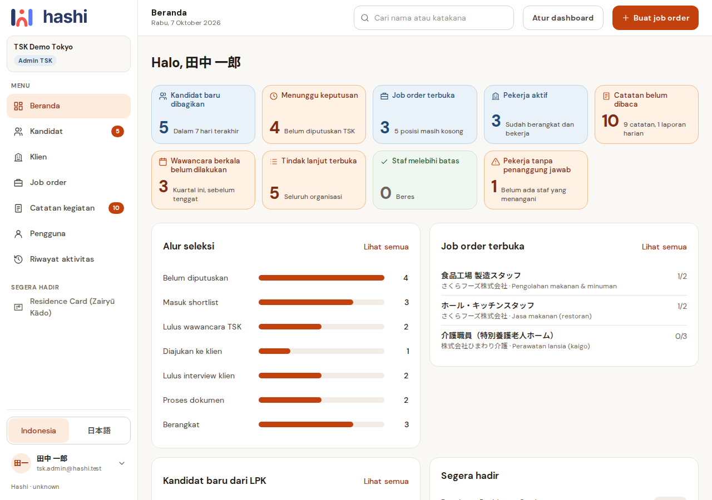
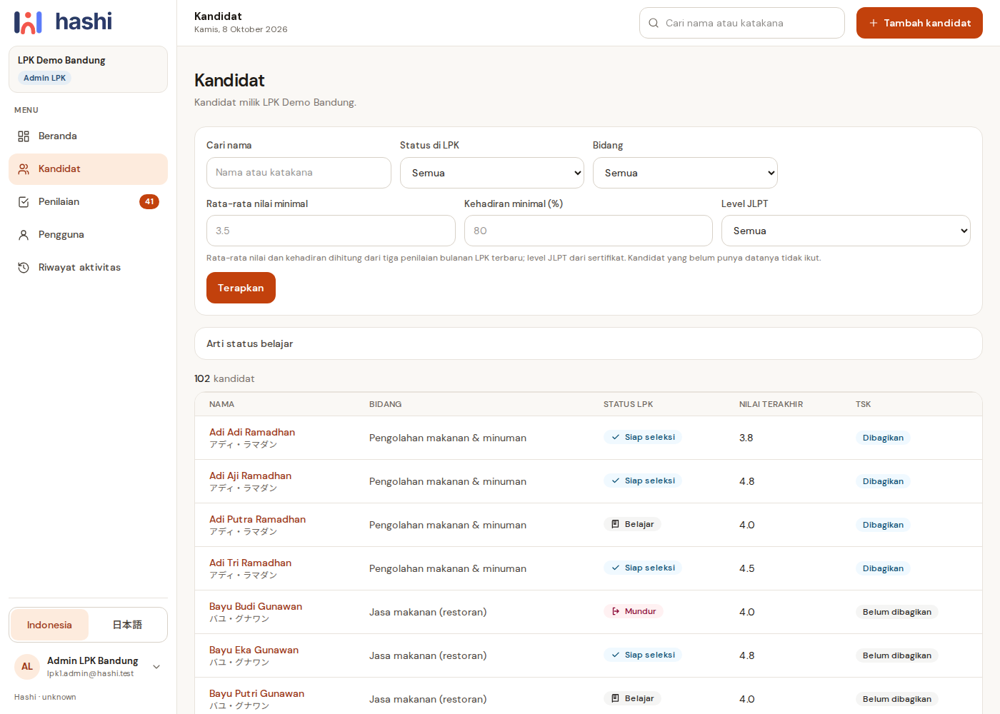
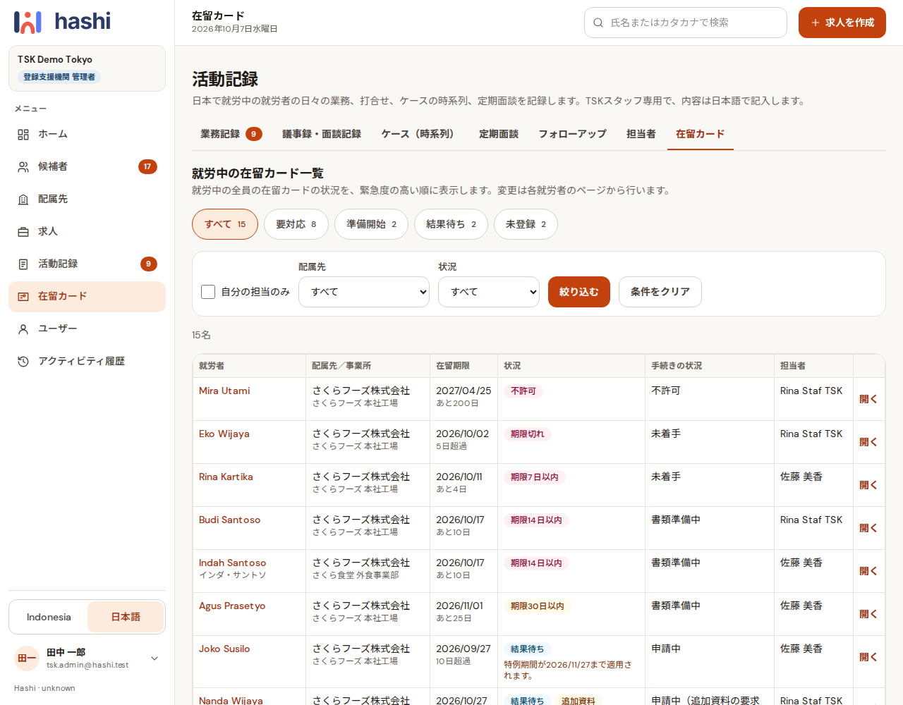
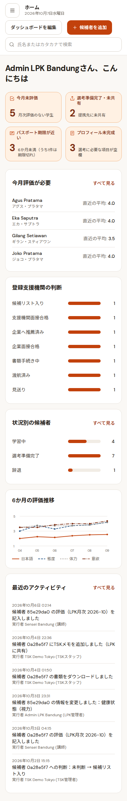

# Hashi 橋

[Bahasa Indonesia](README.md) | **English** | [日本語](README.ja.md)

## About Hashi

A candidate profile and selection system for **LPK** (Indonesian vocational training institutions) and **TSK / 登録支援機関** (Registered Support Organizations in Japan).
One candidate profile, shared by the LPK and its partner TSK, with no re-typing.

> Status (October 2026): steps 1-6 of the MVP specification, TSK activity records (7A), the 在留カード (residence card) tracker (encrypted number and photos, reminder emails,
> online renewal data, the 手数料納付書 fee form PDF for the immigration counter), visa status and arrival date for LPK, and pilot data (200 dummy students) are done.
> Next: the demo to TSK. **Off-server backups must be running before any real data goes in.** Task queue: [docs/TASKS.md](docs/TASKS.md);
> latest report: [docs/STATUS.md](docs/STATUS.md); history and technical decisions: [docs/HISTORY.md](docs/HISTORY.md).

Two kinds of organisation use it together: the **LPK** (training institution; LPK admins and sensei) prepares student profiles, and the **TSK** (support organisation; TSK admins and TSK staff) screens candidates,
places them with clients (配属先), and supports workers after they leave for Japan. Each organisation sees only its own data and what has been deliberately shared with it.

### Technology

| Part | Technology |
| --- | --- |
| Application | Next.js 16 (App Router) + TypeScript + Tailwind CSS 4 |
| Database | PostgreSQL 16 + Drizzle ORM |
| Data isolation | PostgreSQL Row-Level Security (RLS) |
| Login | Auth.js v5 (email + password, 8-hour JWT session) |
| Languages | next-intl (Indonesian / 日本語) |
| Deployment | Docker Compose (OptiPlex) |

## Features by role

| Who | What they can do |
| --- | --- |
| **Super admin** | Adds LPK/TSK organisations with their first admin, edits organisation data, manages users in any organisation, creates and deactivates LPK-TSK partnerships |
| **LPK / TSK admin** | Adds staff (sensei / TSK staff), changes name, role and language, issues a new temporary password, deactivates / reactivates users |
| **LPK admin** (candidates) | Adds candidates with **one complete form** (all sections on one page; only name, gender, date of birth and field are required; repeating sections can have rows added or removed; works on phones; input is kept when there is an error), completes or edits data per section on the detail page, uploads/deletes documents, changes the LPK status, and **controls sharing to the partner TSK** (default: not shared; turning it on requires confirming "the student has agreed"; turning it off immediately hides the candidate from the TSK) |
| **Sensei** | Sees the candidate list and basic data only (no sensitive data or documents) |
| **TSK admin / staff** | Sees candidates of partner LPKs that are **shared** with the TSK, downloads documents, makes decisions and writes notes; can edit data only once the decision is *Passed client interview* or later |
| **TSK admin / staff** (clients and job orders) | Manages **clients** (法人 → site 事業所 → contact person, with the skill fields each site accepts), creates **job orders** (求人) and sees **matching candidates** (same field; language and gender requirements marked green/red; sorted by latest score), presses **Propose**, tracks filled/closed, and enters the placement's **start date (就労開始日)**. Permanent deletion of clients/sites/contacts/job orders: **TSK admin** only |
| **Super admin** (skill fields) | Manages the **skill field** master list (`skill_fields`): add, rename, deactivate; fields in use cannot be deleted |
| **TSK admin / staff** (activity records) | Daily work notes, meeting minutes and interview notes, case timelines (internal PDF and client version), periodic interviews, follow-up tasks, daily reports, photos. Nothing can be deleted (a mistake = void + reason). See [docs/catatan-kegiatan.md](docs/catatan-kegiatan.md) |
| **TSK admin / staff** (client sheets) | PDF export of client profiles and job order sheets in Japanese, in internal or shareable mode. See [docs/lembar-klien.md](docs/lembar-klien.md) |
| **LPK / TSK admin** (history) | The organisation's activity history at `/activity` (cannot be edited or deleted), CSV export |
| **All users** | Log in, switch language, change password under *My account* |
| **All users** | A configurable dashboard per role (order, size, hide widgets) |
| **TSK admin / person in charge (担当)** (在留カード) | Residence card tracker per worker (reminder stages, renewal application, receiving the new card), encrypted card number and photos, copy-ready online renewal data, 手数料納付書 PDF for the counter, the `/records/cards` list, and daily reminder emails. Other TSK staff see only the summary. See [docs/zairyu-card.md](docs/zairyu-card.md) |
| **LPK admin** (workers already in Japan) | Sees ONLY the visa status and arrival date of workers who came from their candidates that were shared with an active partner TSK (not clients, job orders or placements) |

How a new account works:

1. An admin adds a user → the system creates a **temporary password** (shown once)
2. The admin passes it to the user through a safe channel
3. On first login the user **must** set their own password before using the application

Built-in safeguards: an admin cannot deactivate themselves or change their own role, an organisation always keeps at least one active admin, a password reset immediately signs the user out of all sessions,
and a deactivated user cannot get in at once (checked on every request, not when the session expires). Every change is recorded in the audit log.

### Brand

The logo, icons and rules for using them are in [docs/brand.md](docs/brand.md). Derived assets are built with `npm run build:brand` from `design/brand-source/`.

### Activity records (step 7A)

TSK-staff-only features: daily work notes, meeting minutes, case timelines (PDF for clients), periodic interviews, follow-up tasks, daily reports to the leader, photos. Documentation: [docs/catatan-kegiatan.md](docs/catatan-kegiatan.md).
Demo data without a reseed: `npm run seed:records`. **Records are kept for 5 years and cannot be deleted through the application: off-server backups are mandatory before real data goes in.**

### Client sheets (step 6)

Japanese PDF export for clients and job orders (client profile, job order sheet; internal / shareable mode; Japanese labels or Japanese + Indonesian). The format stays a DRAFT until TSK confirms it; all labels and the order of sections are in
`src/lib/pdf/client-sheet.config.ts`. Documentation: [docs/lembar-klien.md](docs/lembar-klien.md). Demo data without a reseed: `npm run seed:client-sheet`.

## Screenshots

All of them show dummy data (demo accounts `*@hashi.test`), not real data. More are in [docs/screenshots/](docs/screenshots/).

| TSK home (Indonesian) | LPK candidate list (Indonesian) |
| --- | --- |
|  |  |

| 在留カード list (Japanese) | LPK home on a phone (Japanese) |
| --- | --- |
|  |  |

## How to run

### Run on the OptiPlex

Requires Docker + Docker Compose and git. In short:

```bash
git clone git@github.com:rivaldydwi/hashi.git ~/hashi && cd ~/hashi
cp .env.example .env            # then fill in random secrets (DB_OWNER_PASSWORD, DB_APP_PASSWORD, AUTH_SECRET); the full commands are in README.md
GIT_SHA=$(git rev-parse --short HEAD) docker compose up -d --build   # migrations run first, automatically
docker compose run --rm migrate npm run db:seed                       # demo data (once)
curl -fsS http://127.0.0.1:3110/api/health                            # health check
```

The seed fills 36 fictitious candidates (3 LPKs × 12) and demo accounts for every role (`*@hashi.test`; the password and the list of accounts are in [README.md](README.md), section "Akun demo").
Port 3100 is used by another application on the OptiPlex, so Hashi listens on `APP_PORT=3110`. Reseeding: `npm run db:seed -- --reset` (development/demo databases only).

### Demo for outside parties

TSK staff who want to try Hashi over a public address use a **separate demo instance** (Compose project `hashi-demo`, port 3111, database `hashi_demo`, its own volumes). Production is not touched.

```bash
scripts/demo-up.sh       # start: creates .env.demo (random secrets), builds, runs, seeds, prints the demo accounts
scripts/demo-reset.sh    # refill the demo data only
scripts/demo-down.sh     # stop (data stays); `--purge` also removes the demo volumes
```

The scripts refuse to run when `.env.demo` is unsafe. HTTPS goes through a proxy or tunnel pointed at `http://127.0.0.1:3111`.
**The demo instance may only contain dummy data. Production (`hashi`, port 3110) must never be exposed to the internet.** Details: [README.md](README.md), section "Demo untuk pihak luar".

### Update to the latest version

```bash
cd ~/hashi
scripts/deploy.sh            # git pull --ff-only + build with GIT_SHA + wait until /api/health reports the new commit; migrations run automatically
                             # options: --backup (back up first), --check (check prerequisites only)
```

Verifying production is done through **green CI** (`gh run list`) and `/api/health`. Never run `test:rls` against the production database.

### Daily commands

```bash
docker compose ps                         # status
docker compose logs -f app                # application log
scripts/deploy.sh                         # update to the latest version
docker compose down                       # stop (data stays safe in the volumes)
docker compose run --rm migrate npm run db:seed -- --reset   # refill demo data from scratch
```

Memory limits: app 768 MB, database 512 MB.

## Security and personal data

In short (details are in the technical sections and the feature documents):

- **Isolation between organisations with PostgreSQL RLS**: the application connects as the `hashi_app` role, which cannot bypass RLS; access rules are also enforced by database triggers, not only by the application.
- **Sensitive data is limited per role**: sensei see the basic profile only; a TSK sees only candidates the LPK has shared (a single gate, not shared by default, requires confirming "the student has agreed").
- **在留カード numbers and photos are encrypted** (AES-256-GCM) and open only to the TSK admin and the worker's person in charge; every reveal is written to the audit log. The `CARD_DATA_KEY` key lives in `.env`: **if the key is lost, the data cannot be recovered** ([docs/zairyu-card.md](docs/zairyu-card.md), [docs/backup.md](docs/backup.md)).
- **The activity history cannot be edited or deleted** (a trigger refuses, even for the OWNER) and never contains note text, candidate names or document numbers.
- **Browser translation**: automatic translation (e.g. Chrome's "Translate") is NOT blocked so staff can read labels and free text; only identity data (names, addresses, phone numbers, codes, document numbers) is locked. Exception: health notes are locked because Chrome sends the text to Google's servers to translate it.
- **Production is never opened to the internet**; only the demo instance (dummy data) may have a public address. This repository is public: never put secrets, IP addresses or personal data in it.

### Data security: how RLS works

The application connects to the database as the **`hashi_app`** role, which cannot bypass RLS. Migrations and seeding use the **`hashi_owner`** role. All tenant data is read and written through `withTenant({ orgId, role, userId }, …)`, which sets `app.role` and `app.user_id` for the RLS policies.

Candidate access in brief (the full rules are in [README.md](README.md), section "Hak akses data kandidat", and `CLAUDE.md`):

- The LPK status (`stage`) and the TSK decision are **separate**. Only the LPK admin sets the status; each TSK sees and writes only its own decision rows. The LPK may read decisions but not write them.
- TSK notes are `TSK_ONLY` by default or `SHARED_WITH_LPK`. Sensei never read them, and nobody can delete them.
- A partner TSK reads only candidates with `shared_with_tsk = true` (turned on only by the LPK admin). Turning sharing off hides the candidate but deletes no decisions or notes.
- A TSK edits candidate data only when ITS OWN decision is *Passed client interview*, *Document process* or *Departed* (an explicit list, never `>=` on an enum) and the candidate has not withdrawn.
- Assessments: monthly LPK assessments are read by the LPK admin and sensei and by the TSK (if shared); TSK interview/visit assessments belong to the TSK and reach the LPK admin only when explicitly shared.
- Clients and job orders belong to the TSK only: LPK, sensei and other TSKs get no rows (and a 404 in the UI).
- Every table with a `candidate_id` must be added to part I of `scripts/verify-rls.ts`; `npm run test:rls` checks every rule above.

## Backup

Backups (database + document volume), encrypted, and how to restore them: **[docs/backup.md](docs/backup.md)** (`scripts/backup.sh`, `scripts/restore.sh`). The scheduled job and the off-server copy still have to be set up (checklist in [docs/pilot-checklist.md](docs/pilot-checklist.md)).

Candidate documents (PDF/JPG/PNG, max 10 MB) live in the **Docker named volume `docs-data`** (`/app/docs-data` in the `app` container), as `<org_id>/<candidate_id>/<document_id>.<ext>`. File names on disk are always the document id,
the file type is checked from the content, and downloads go only through the application (login + RLS, written to the audit log). Document metadata is in the database, so **a backup must include the database AND the `docs-data` volume**: one without the other cannot restore anything.
Residence card photos are encrypted in the same volume (`cards/`); keep `CARD_DATA_KEY` backed up separately from the data.

## Development and testing

### Development (separate database)

The dev database is its own `db-dev` service (container + volume + port `127.0.0.1:5433`), separate from production, so a production `docker compose up -d --build` does not interrupt it.

```bash
docker compose -f compose.yaml -f compose.dev.yaml up -d db-dev
# .env: DATABASE_URL / MIGRATE_DATABASE_URL -> .../hashi_dev on 127.0.0.1:5433
npm run db:migrate && npm run db:seed
npm run dev                       # http://localhost:3100
```

`npm run test:e2e`, `npm run test:rls` and `npm run db:seed -- --reset` **refuse to run** when the database name does not end in `_dev` or `_test` (`scripts/db-guard.ts`). CI uses the `hashi_test` database.

### Testing

| Command | What it checks |
| --- | --- |
| `npm run typecheck` | TypeScript |
| `npm run test:unit` | Unit tests (`node:test`) |
| `npm run test:rls` | Database rules: data isolation, roles, candidate access, TSK decisions and notes, partnerships, audit log (dev/test database only) |
| `npm run test:i18n` | The Indonesian and Japanese message keys are identical, and Indonesian text has no bare Japanese characters |
| `npm run verify:audit-coverage` | Every server action that writes also writes to the audit log |
| `npm run test:e2e` | Browser scenarios (Playwright); adds test data, so dev/test database only |

All of them run automatically on GitHub Actions for every code change (documentation-only changes do not trigger CI). New tables: a Drizzle migration + a manual SQL migration (`GRANT`, `ENABLE` + `FORCE ROW LEVEL SECURITY`, policies) + checks in `scripts/verify-rls.ts`.

### Development without Docker

Install Node 22 and PostgreSQL 16, fill in `DATABASE_URL` and `MIGRATE_DATABASE_URL` in `.env` (see `.env.example`), then `npm ci && npm run db:migrate && npm run db:seed && npm run dev`.

### Folder structure

```
drizzle/                 SQL migrations (RLS, triggers and GRANTs are written by hand)
messages/                interface text: id.json, ja.json (identical keys)
scripts/                 migrate, seed, verify-* (rls, seed, i18n, audit), demo/deploy/backup scripts
src/db/                  schema, withTenant/withSystem, shared queries, demo data, audit (the only thing scripts/ may import)
src/features/            logic per feature (candidates, assessments, clients, job-orders, records, cards, documents, dashboard, audit, users, ...)
src/lib/                 session, permissions, audit(), PDF, time zones
src/components/          application shell and shared components
src/app/                 pages (login and the (app) group after login)
tests/unit/ tests/e2e/   unit tests and browser tests
docs/                    task queue, status, feature documents, glossary, brand, screenshots
```

### Decision notes

- **Drizzle, not Prisma**: no binary engine (smaller image, faster builds on the OptiPlex), and RLS is easier to manage because migrations are plain SQL.
- **Login rate limit** (5 wrong attempts per 15 minutes per email) is kept in memory. That is enough for one server.
- **Before real student data**: set `SHOW_DEMO_ACCOUNTS=false`, set up automatic off-site backups, and have a personal-data consent form ready (see the MVP specification).

## Documents and how the team works

Documentation in `docs/`:

| File | Contents |
| --- | --- |
| [docs/TASKS.md](docs/TASKS.md) · [docs/STATUS.md](docs/STATUS.md) · [docs/HISTORY.md](docs/HISTORY.md) | Task queue (PM), engineer reports, history and technical decisions |
| [docs/glossary.md](docs/glossary.md) | Glossary of Japanese, Indonesian and English terms |
| [docs/catatan-kegiatan.md](docs/catatan-kegiatan.md) | TSK activity records (業務記録, 面談, 定期面談, form 5-5) |
| [docs/lembar-klien.md](docs/lembar-klien.md) | Client sheet PDFs (DRAFT format) |
| [docs/zairyu-card.md](docs/zairyu-card.md) | 在留カード tracker, encryption, reminder emails, online renewal |
| [docs/email.md](docs/email.md) | Setting up SMTP for reminder emails |
| [docs/backup.md](docs/backup.md) | Encrypted backups and restoring |
| [docs/pilot-checklist.md](docs/pilot-checklist.md) | Checklist before the pilot and the dummy pilot data |
| [docs/brand.md](docs/brand.md) | Logo, icons and usage rules |
| [docs/screenshots/](docs/screenshots/) | Screenshots (dummy data) |

This README comes in three languages with the same heading structure: [Bahasa Indonesia](README.md), English (this file), [日本語](README.ja.md).

### How the team works

Ipal (the owner) decides; the **PM** (a Claude session at claude.ai/code) writes tasks in [docs/TASKS.md](docs/TASKS.md) and reviews pull requests;
the **engineer** (Claude Code in VS Code on the Mini PC) works on tasks in `eng/<ID>-…` branches, reports in [docs/STATUS.md](docs/STATUS.md),
and merges once the PM writes `PM: DISETUJUI` on the PR. Full rules: `CLAUDE.md`, section "Peran dan aturan kerja".
