# Buku panduan Hashi

Panduan mencoba Hashi sendiri, langkah demi langkah, untuk staf LPK dan staf TSK. Semua contoh memakai data dummy; tidak ada data siswa atau pekerja sungguhan.

## 0. Cara memakai buku ini

Buku ini ditulis supaya kamu bisa **membuka aplikasi demo di samping dan mengikuti langkahnya**. Tidak perlu paham teknis.

- Bab 1 menjelaskan Hashi, peran, login, dan beranda.
- Bab 2 untuk **LPK** (Admin LPK dan Sensei). Bab 3 untuk **TSK** (Admin TSK dan Staf TSK).
- Bab 4 berisi **empat contoh kasus** lengkap dengan gambar. Kalau mau cepat paham, mulai dari sini, lalu buka bab 2 dan 3 bila perlu rincian.
- Bab 5 berisi tanya jawab (kenapa data tidak terlihat, kenapa tombol tidak bisa ditekan, dan sejenisnya).

**Akun demo.** Semua akun memakai alamat `@hashi.test`. Pada aplikasi demo standar kata sandinya `hashi-demo-2026`. Pada aplikasi demo untuk pihak luar, kata sandinya acak dan dicetak oleh skrip `scripts/demo-up.sh` (tanyakan ke pengelola demo).

| Email | Peran | Dipakai untuk |
| --- | --- | --- |
| `lpk1.admin@hashi.test` | Admin LPK Bandung | Bab 2, skenario A |
| `lpk1.sensei@hashi.test` | Sensei LPK Bandung | Tampilan Sensei (bagian 2.12) |
| `lpk2.admin@hashi.test` | Admin LPK Surabaya | Cadangan, LPK kedua yang bermitra dengan TSK |
| `lpk3.admin@hashi.test` | Admin LPK Medan | LPK yang **tidak** bermitra (tidak terlihat oleh TSK) |
| `tsk.admin@hashi.test` | Admin TSK | Bab 3, skenario B, C, D |
| `tsk.staff@hashi.test` | Staf TSK | Perbandingan hak akses Staf dan Admin |
| `admin@hashi.test` | Super admin | Mengelola organisasi (di luar buku ini) |

> Akun `tsk.admin` awalnya tampil berbahasa Jepang (akun lain bisa berbeda). Klik **Indonesia** di kiri bawah layar untuk mengganti ke bahasa Indonesia. Semua gambar di buku ini memakai bahasa Indonesia, kecuali isi catatan kegiatan yang memang ditulis dalam bahasa Jepang.

> Format tanggal pada kolom isian mengikuti pengaturan peramban (di gambar tertulis bulan/tanggal/tahun). Di komputermu bisa tampil tanggal/bulan/tahun.

**Mengulang dari awal.** Kalau data demo sudah berantakan, minta pengelola menjalankan `scripts/demo-reset.sh`. Data demo kembali ke keadaan awal dan skenario bisa diulang.

## 1. Mulai

### 1.1 Apa itu Hashi

Hashi adalah tempat **satu profil kandidat** dipakai bersama oleh dua pihak, tanpa ketik ulang:

- **LPK** (lembaga pelatihan kerja di Indonesia) menyiapkan profil, dokumen, dan nilai siswa.
- **TSK** (登録支援機関, lembaga pendukung di Jepang) memilih kandidat, mencarikan tempat kerja di klien, lalu mendampingi pekerja setelah berangkat.

Perjalanan seorang kandidat di Hashi:

1. **Siswa terdaftar** di LPK (profil, dokumen, penilaian bulanan).
2. **LPK membagikan** profil ke TSK mitra, hanya bila siswa sudah setuju.
3. **TSK menyeleksi**: masuk shortlist, lulus wawancara TSK, diajukan ke klien, lulus interview klien, proses dokumen.
4. **Berangkat**: kandidat otomatis menjadi **pekerja aktif** di TSK.
5. **Setelah berangkat**: catatan kegiatan, wawancara berkala, pelacak kartu izin tinggal (在留カード) dengan pengingat. LPK hanya melihat tanggal tiba dan status visa.

Setiap organisasi hanya melihat datanya sendiri dan apa yang sengaja dibagikan kepadanya.

### 1.2 Peran: siapa melihat dan melakukan apa

| Peran | Bisa melihat | Bisa mengubah |
| --- | --- | --- |
| **Admin LPK** | Semua kandidat LPK-nya, keputusan TSK, catatan TSK yang dibagikan ke LPK, status visa dan tanggal tiba pekerja yang sudah berangkat | Semua data kandidat, status belajar, penilaian bulanan, **berbagi ke TSK**, pengguna LPK, hapus kandidat |
| **Sensei** | Daftar dan **data dasar** kandidat saja (tanpa data sensitif, keluarga, dokumen) | Penilaian bulanan |
| **Admin TSK** | Kandidat LPK mitra **yang dibagikan**, klien, job order, catatan kegiatan, kartu izin tinggal, riwayat aktivitas | Keputusan, catatan, penilaian TSK, klien, job order, penanggung jawab pekerja, semuanya di catatan kegiatan dan kartu |
| **Staf TSK** | Sama dengan Admin TSK, tetapi tidak mengelola pengguna dan tidak menetapkan penanggung jawab | Sama seperti Admin TSK, dengan batas (mis. kartu hanya untuk pekerja yang menjadi tanggung jawabnya) |

Hal-hal yang **tidak pernah** terlihat: LPK tidak melihat klien dan job order TSK; TSK tidak melihat kandidat yang tidak dibagikan; Sensei tidak melihat data sensitif dan dokumen.

### 1.3 Login, bahasa, dan kata sandi

Buka alamat aplikasi, isi email dan kata sandi, lalu tekan **Masuk**. Pada aplikasi demo, daftar akun demo tampil di bawah form (klik **Akun demo**).

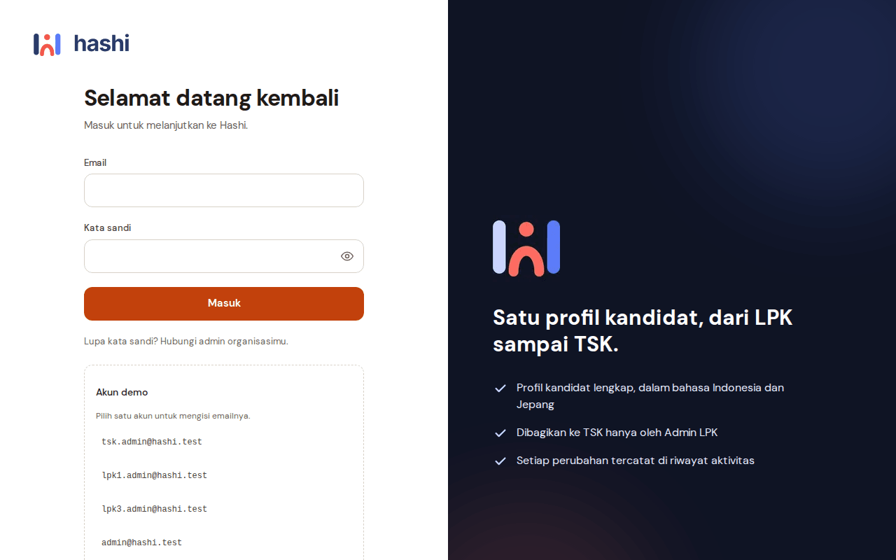

Di kiri bawah ada pilihan bahasa **Indonesia / 日本語**. Pilihan bahasa tersimpan untuk akunmu.

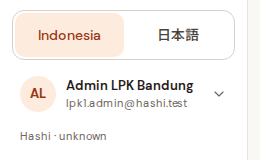

Tepat di bawahnya ada menu akunmu (**Akun saya** dan **Keluar**):

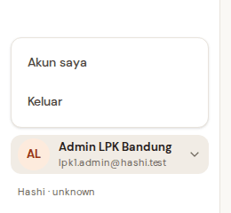

Ganti kata sandi lewat menu akun → **Akun saya**. Kata sandi baru minimal 10 karakter. Pengguna baru mendapat kata sandi sementara dari adminnya dan **wajib** menggantinya saat login pertama.

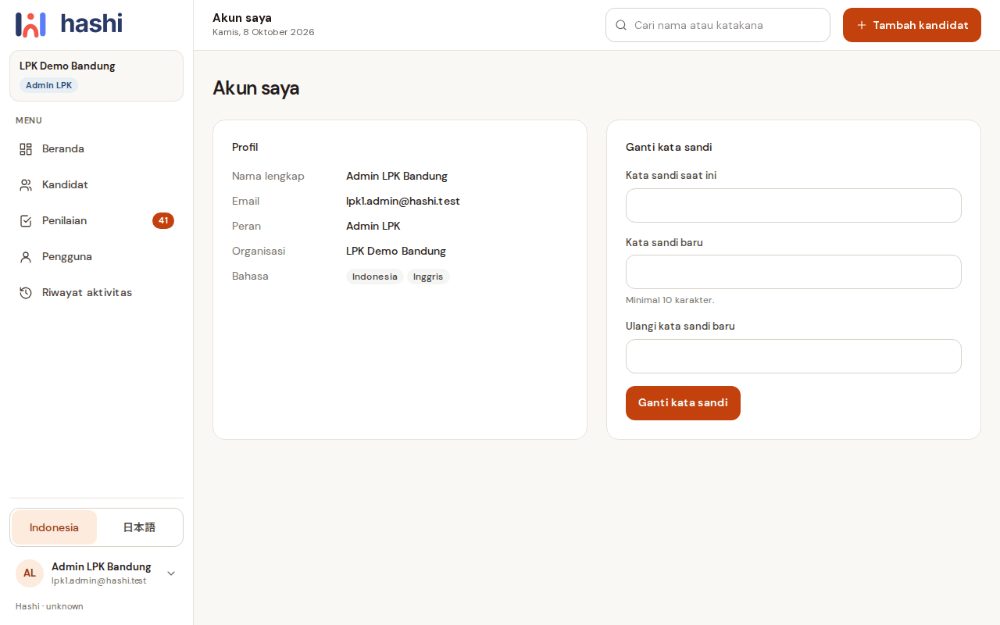

### 1.4 Beranda dan kartu angka (KPI)

Beranda berisi **kartu angka** di atas dan beberapa **panel** di bawahnya. Kartu yang menyala jingga artinya ada yang perlu kamu urus; kartu tenang (dengan centang dan kata "Beres") artinya tidak ada. Menekan kartu membuka daftar yang **persis sama** dengan angkanya.

Beranda Admin LPK:

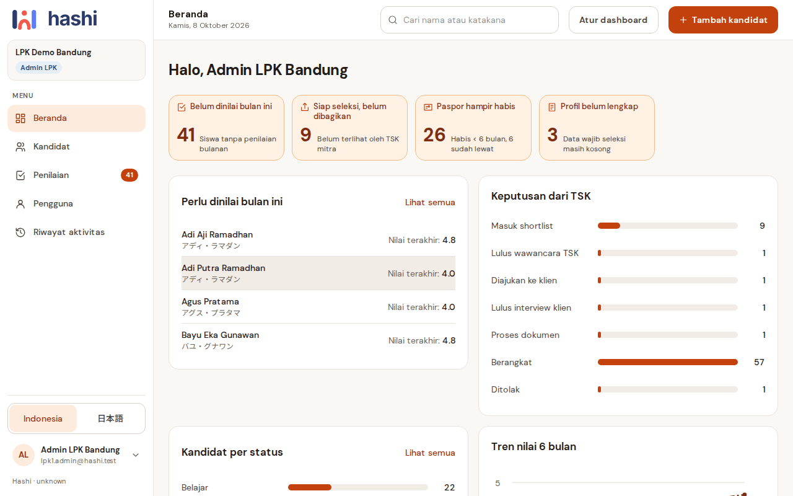

- **Belum dinilai bulan ini**: siswa Belajar atau Siap seleksi tanpa penilaian bulan ini.
- **Siap seleksi, belum dibagikan**: siswa siap tetapi belum terlihat oleh TSK.
- **Paspor hampir habis**: paspor kedaluwarsa kurang dari 6 bulan atau sudah lewat.
- **Profil belum lengkap**: data wajib seleksi masih kosong.

Beranda Admin TSK memuat kartu seperti **Kandidat baru dibagikan**, **Menunggu keputusan**, **Job order terbuka**, **Pekerja aktif**, **Catatan belum dibaca**, **Wawancara berkala belum dilakukan**, **Tindak lanjut terbuka**, **Kartu perlu tindakan**, dan **Pekerja tanpa penanggung jawab**:

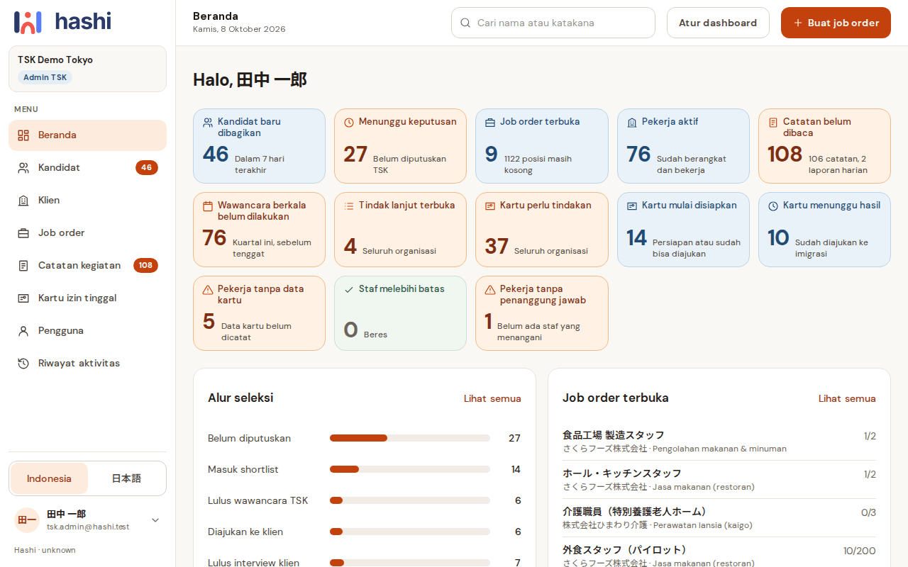

Di ponsel, menu ada di tombol di kiri atas dan kartu tersusun dua kolom:

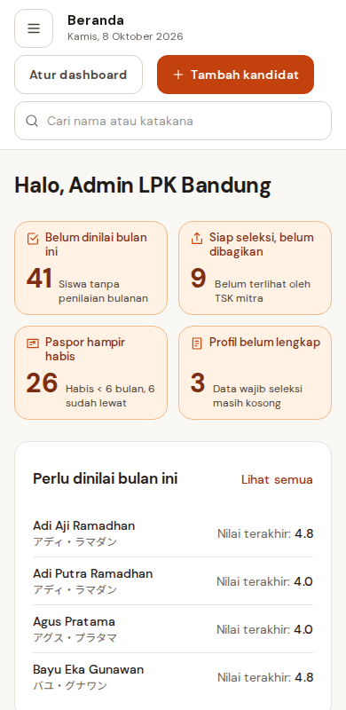

**Mengatur dashboard.** Tekan **Atur dashboard** di kanan atas. Tiap kartu dan panel punya tombol naik/turun, **Sembunyikan**, dan (untuk panel) ukuran **Setengah / Penuh**. Perubahan tersimpan otomatis dan hanya berlaku untuk akunmu. **Kembalikan ke bawaan** mengosongkan pengaturan; **Selesai** keluar dari mode atur.

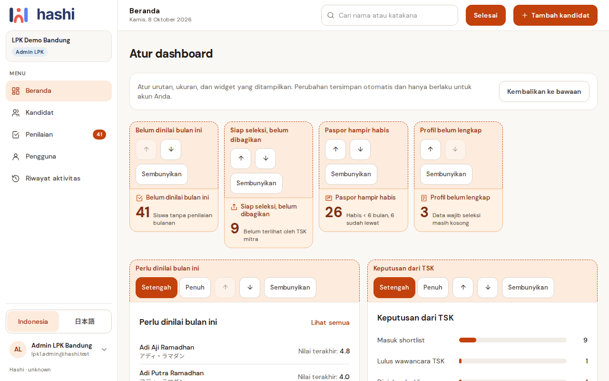

## 2. Panduan LPK (Admin LPK dan Sensei)

Menu Admin LPK: **Beranda, Kandidat, Penilaian, Pengguna, Riwayat aktivitas**.

### 2.1 Daftar kandidat dan filter

Menu **Kandidat** menampilkan semua siswa LPK-mu. Kolom **TSK** menunjukkan apakah siswa **Dibagikan** atau **Belum dibagikan**. Pakai kotak filter: **Cari nama** (huruf latin atau katakana), **Status di LPK**, **Bidang**, **Rata-rata nilai minimal**, **Kehadiran minimal (%)**, dan **Level JLPT**. Rata-rata dan kehadiran dihitung dari tiga penilaian bulanan terbaru; siswa yang belum punya data itu tidak ikut hasil filter.

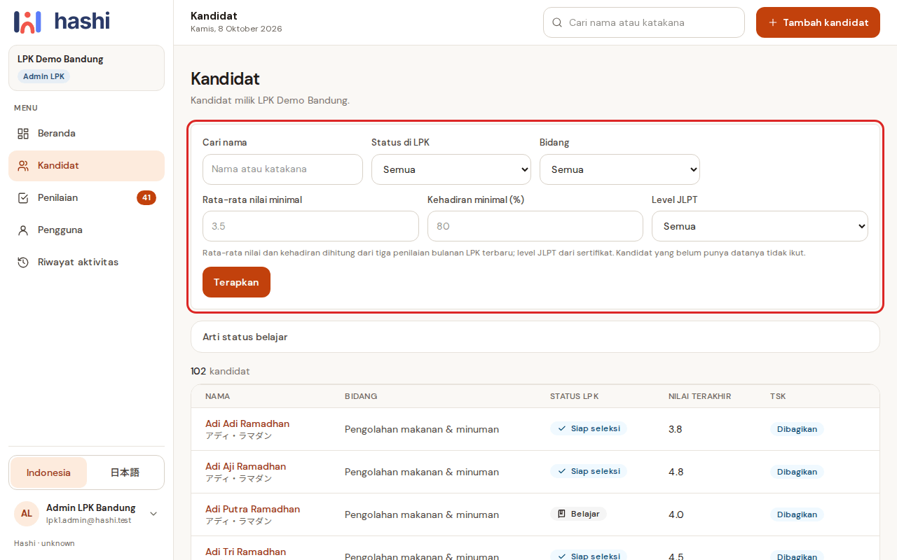

Filter yang aktif tampil sebagai **chip** di bawah kotak filter; tekan tanda silang di chip atau **Hapus semua filter** untuk mencabutnya.

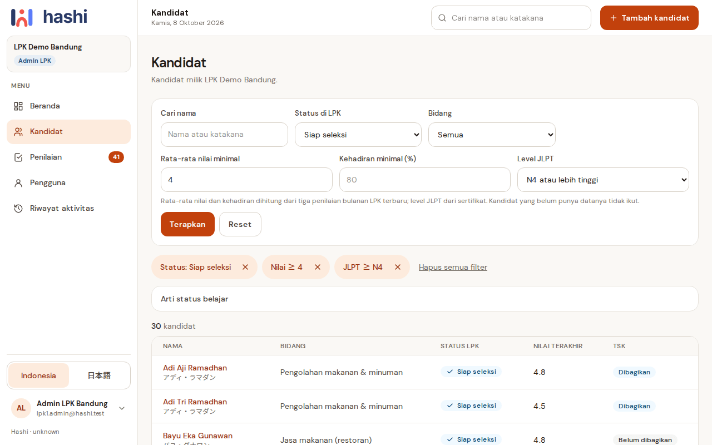

### 2.2 Tambah kandidat

Tekan **Tambah kandidat** (kanan atas). Semua bagian ada dalam **satu halaman**; hanya **nama lengkap, jenis kelamin, tanggal lahir, dan bidang** yang wajib. Bagian lain boleh dikosongkan dan dilengkapi nanti.

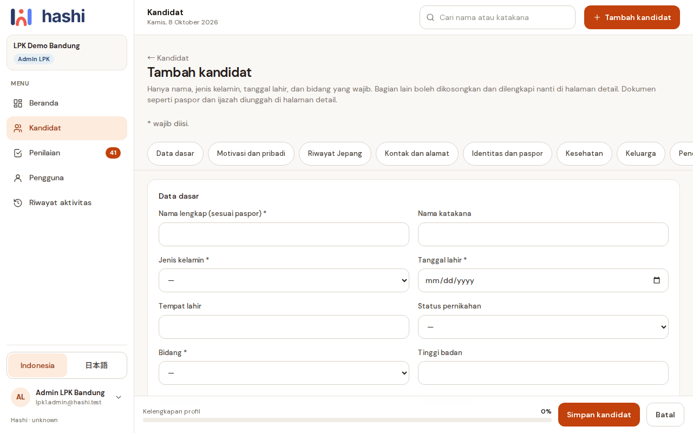

Tips mengisi:

- Gunakan nama **sesuai paspor**. Nama katakana opsional tetapi membantu TSK mencari.
- Bar di bawah layar menunjukkan **Kelengkapan profil** (persentase naik saat kolom terisi). Tombol bagian di atas (Data dasar, Motivasi dan pribadi, dan seterusnya) melompat ke bagian itu.
- Bagian berulang (keluarga, pendidikan, riwayat kerja, sertifikat) punya tombol **+ Tambah** untuk baris baru.
- Kalau ada yang salah, pesan galat muncul di bagian terkait dan **isianmu tidak hilang**. Menutup halaman dengan perubahan yang belum disimpan memunculkan peringatan.
- Nilai yang terisi otomatis diberi catatan **Diisi otomatis, periksa**.

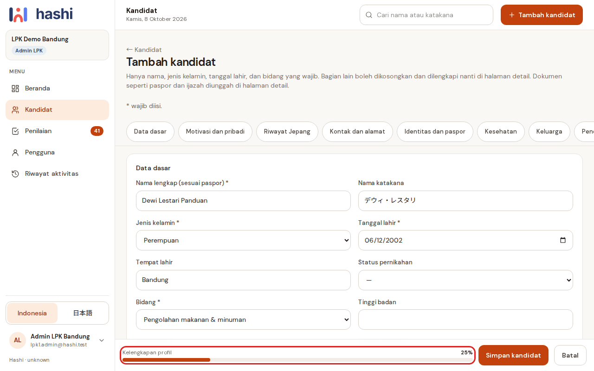

Tekan **Simpan kandidat**. Kamu masuk ke halaman detail dengan pesan "Kandidat berhasil ditambahkan".

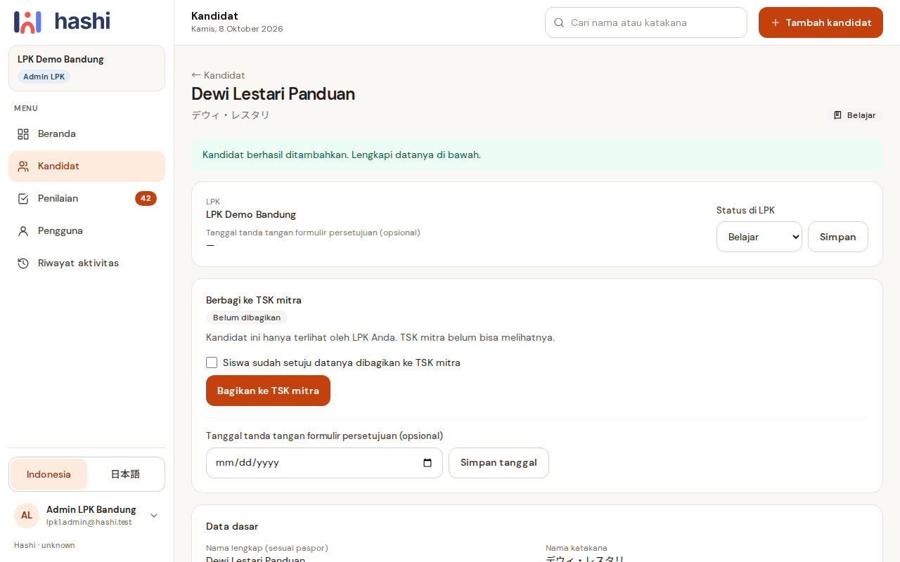

### 2.3 Detail kandidat dan dokumen

Halaman detail memuat bagian-bagian profil. Tekan **Ubah** pada sebuah bagian untuk mengeditnya; hanya bagian itu yang disimpan.

Bagian **Dokumen** menyimpan paspor, pas foto, medical check-up, ijazah, dan lainnya (PDF, JPG, atau PNG, maksimal 10 MB). Buka **+ Unggah dokumen**, pilih **Jenis dokumen**, pilih file, isi tanggal terbit/berlaku bila ada, lalu **Unggah dokumen**. Jenis file diperiksa dari isinya, bukan dari nama berkas.

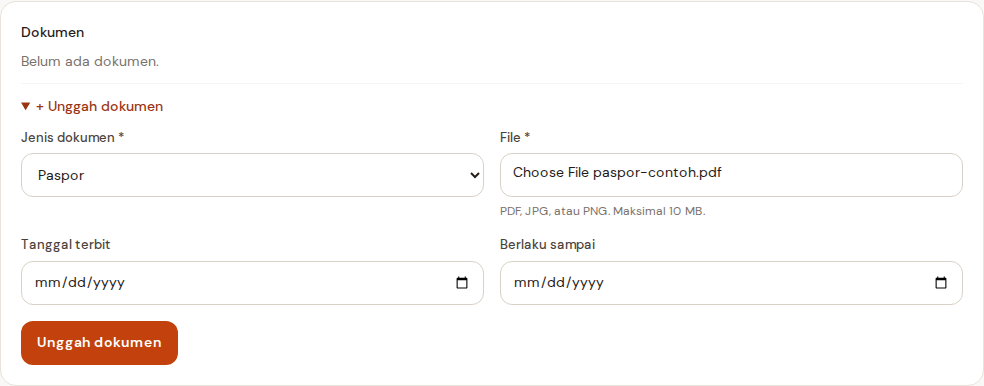

Dokumen diunduh lewat tombol **Unduh**; setiap unduhan dicatat di riwayat aktivitas.

### 2.4 Status belajar

Di bagian atas halaman detail, pilih **Status di LPK**: **Belajar**, **Siap seleksi**, atau **Mundur**, lalu **Simpan**. Status ini milik LPK: TSK tidak bisa mengubahnya dan keputusan TSK tidak mengubahnya. Kandidat yang **Mundur** tidak muncul di daftar kandidat cocok TSK.

### 2.5 Penilaian bulanan

Satu penilaian per kandidat per bulan (wawancara/mendan bulanan). Buka bagian **Penilaian** → **+ Tambah penilaian bulanan**. Isi **Tanggal wawancara**, **Durasi**, empat nilai 1 sampai 5 (**Bahasa Jepang, Sikap belajar, Kebugaran, Motivasi**), **Kehadiran (%)**, tes bila ada, dan **Catatan**.

> Jangan menulis diagnosis atau data medis di catatan penilaian.

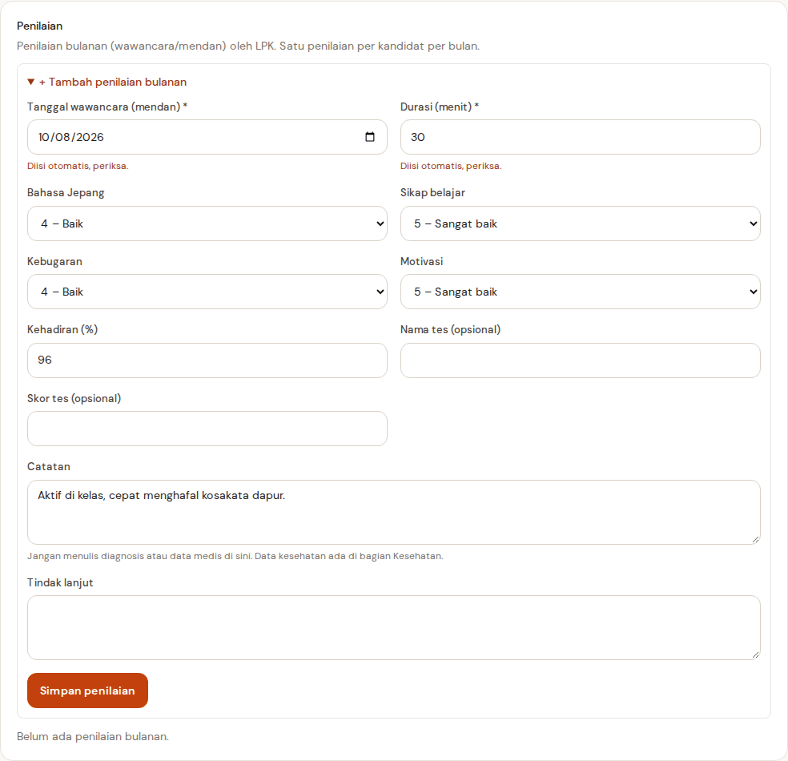

Setelah disimpan, penilaian tampil di tabel dengan **rata-rata**, panah naik/turun dibanding bulan sebelumnya, dan **Detail dan ubah**.

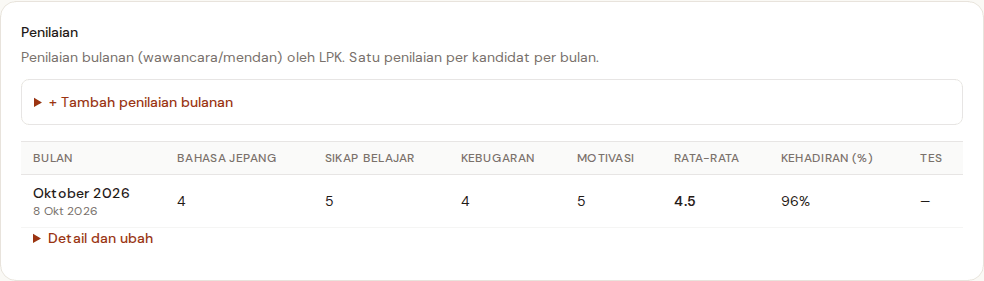

Menu **Penilaian** (dan kartu **Belum dinilai bulan ini**) menampilkan siswa yang belum dinilai bulan ini; tombol **Nilai sekarang** langsung membuka kandidatnya.

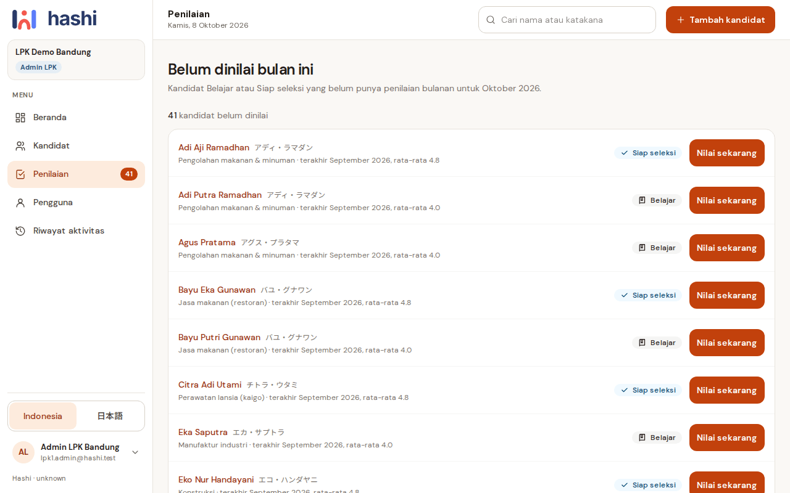

### 2.6 Berbagi ke TSK

Secara bawaan kandidat **Belum dibagikan**: hanya LPK-mu yang melihatnya. Hanya **Admin LPK** yang boleh mengaktifkan berbagi, dan **hanya setelah siswa setuju**. Di bagian **Berbagi ke TSK mitra**, centang **Siswa sudah setuju datanya dibagikan ke TSK mitra**, lalu **Bagikan ke TSK mitra**. Tanggal tanda tangan formulir persetujuan boleh dicatat (opsional) sebagai arsip.

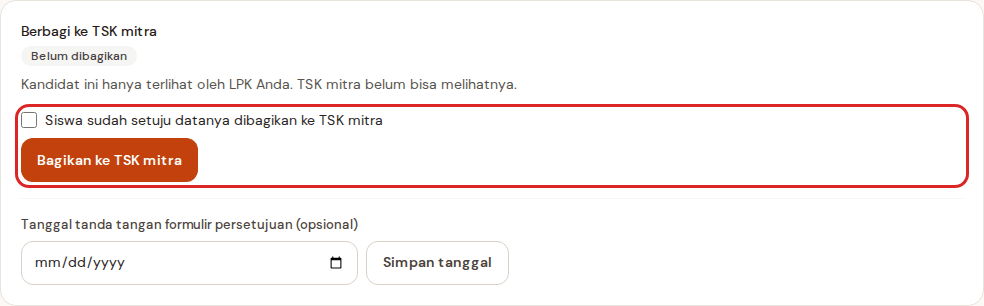

Setelah dibagikan, statusnya menjadi **Dibagikan ke TSK mitra**. TSK mitra bisa melihat data, dokumen, dan catatan kandidat.

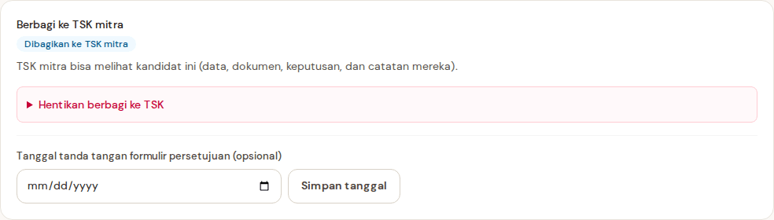

Untuk menghentikan, buka **Hentikan berbagi ke TSK**. Ada peringatan: TSK **langsung** tidak bisa melihat kandidat ini lagi. Data, dokumen, catatan, dan keputusan TSK **tidak dihapus**; hanya tidak terlihat.

### 2.7 Melihat keputusan dan catatan TSK

Bagian **Keputusan TSK** menunjukkan keputusan tiap TSK mitra atas kandidatmu (mis. **Masuk shortlist, Diajukan ke klien, Berangkat**). LPK hanya membaca; tidak bisa mengubah. Catatan dan penilaian TSK hanya tampil bila TSK sengaja memilih **Bagikan ke LPK**, dan hanya untuk Admin LPK (Sensei tidak melihatnya).

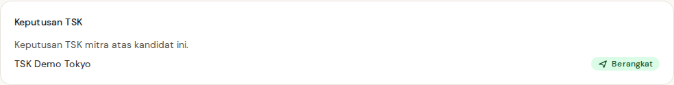

### 2.8 Setelah berangkat: tanggal tiba dan status visa

Kalau kandidatmu sudah **Berangkat**, muncul bagian **Setelah berangkat**. Hanya ada dua informasi: **tanggal tiba di Jepang** dan **status visa** (Berlaku, Sedang diperpanjang, Sudah habis, atau Belum ada data) beserta **Berlaku sampai**. Kamu tidak melihat nama klien, job order, atau penempatan.

Sebelum TSK mencatat kartu izin tinggal pekerja, status visa tampil **Belum ada data**:

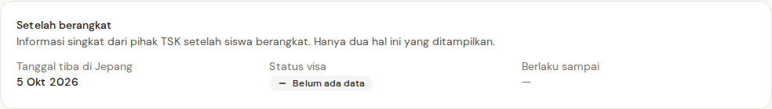

Setelah kartu dicatat, statusnya mengikuti kartu aktif:

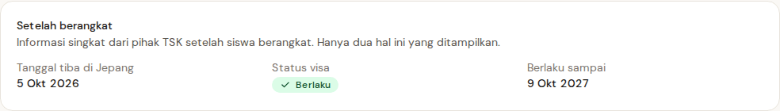

### 2.9 Mengelola pengguna

Menu **Pengguna** menampilkan staf LPK-mu (Admin LPK dan Sensei). Admin bisa **Tambah pengguna**, **Ubah** nama/peran/bahasa, membuat **kata sandi sementara baru**, dan menonaktifkan atau mengaktifkan kembali. Kolom **Bahasa** berisi bahasa yang dikuasai pengguna (bukan bahasa tampilan; itu diatur lewat tombol bahasa).

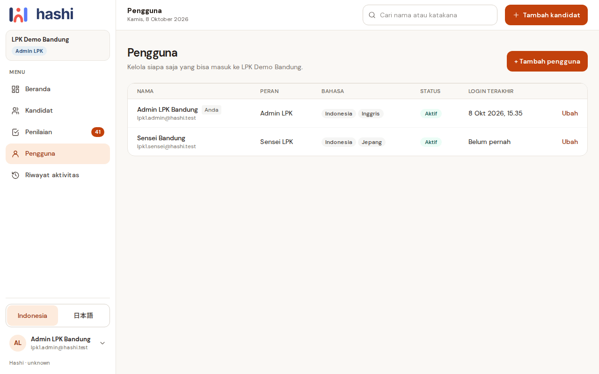

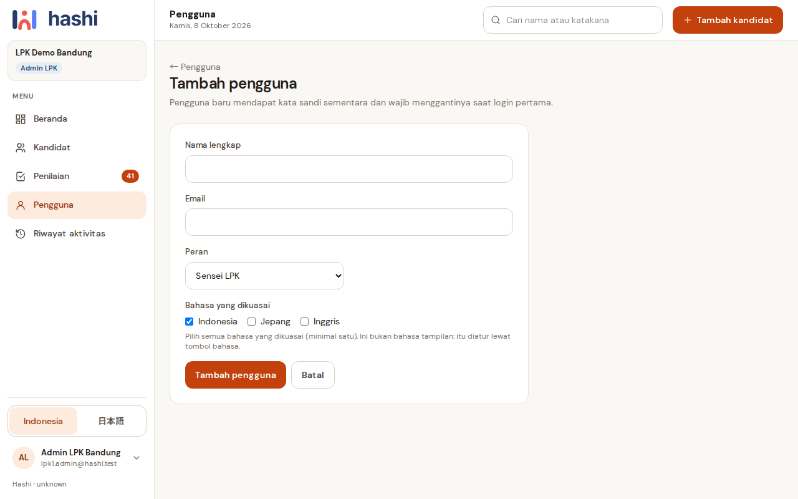

Setelah menyimpan, kata sandi sementara **tampil sekali**; berikan lewat jalur aman. Pengamannya: admin tidak bisa menonaktifkan atau mengubah peran dirinya sendiri, dan LPK selalu punya minimal satu admin aktif.

### 2.10 Riwayat aktivitas dan ekspor

Menu **Riwayat aktivitas** mencatat siapa melakukan apa di organisasimu (masuk, mengubah data, mengunduh dokumen, keputusan TSK atas kandidatmu, dan seterusnya). Riwayat **tidak bisa diubah atau dihapus** dan tidak memuat isi catatan atau nama kandidat (hanya kode 8 karakter). Pakai filter **Jenis aktivitas** dan tanggal, lalu **Ekspor CSV** bila perlu.

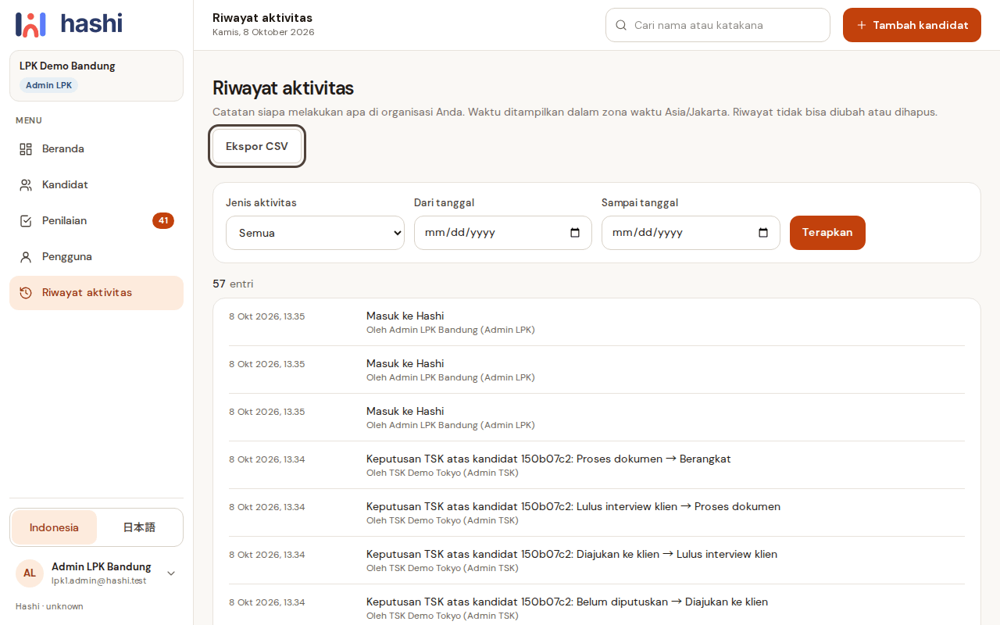

### 2.11 Hapus kandidat

Hanya **Admin LPK** yang bisa menghapus kandidat secara permanen, di bagian **Zona berbahaya** (paling bawah halaman detail). Pakai ini hanya untuk data salah input. Dialog menampilkan data apa saja yang ikut terhapus dan meminta kamu **mengetik nama (atau kode) kandidat persis** sebelum tombol **Hapus permanen** aktif. Siswa yang tidak aktif lagi sebaiknya dijadikan **Mundur**, bukan dihapus.

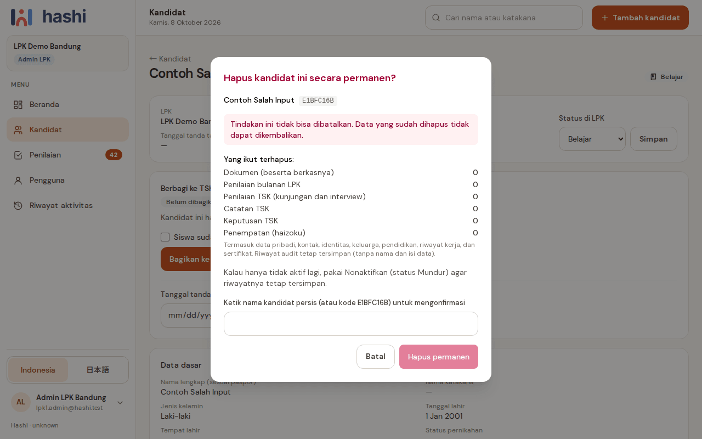

Penghapusan **ditolak** untuk kandidat yang sedang diproses TSK (**Proses dokumen** atau **Berangkat**) atau yang punya catatan di sisi TSK:

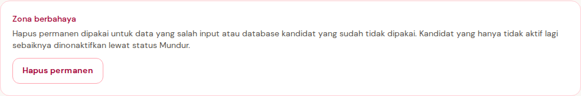

### 2.12 Tampilan Sensei

Sensei (mis. `lpk1.sensei@hashi.test`) punya menu **Beranda, Kandidat, Penilaian**. Berandanya berisi siswa yang perlu dinilai, penilaian terakhirnya, dan siswa yang **perlu perhatian** (kehadiran di bawah 80% atau nilai turun).

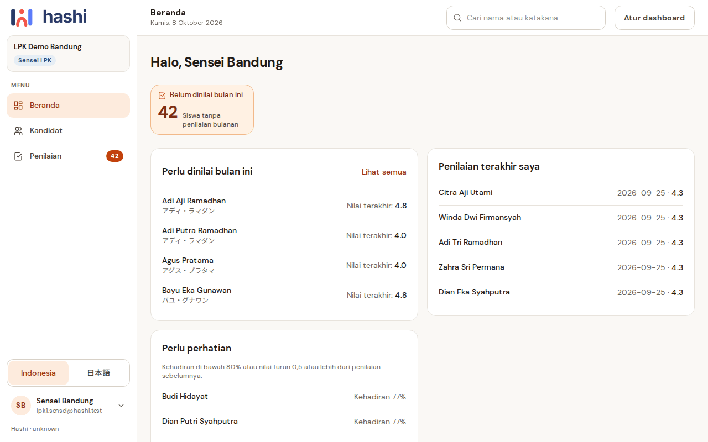

Pada halaman detail, Sensei hanya melihat **data dasar** (nama, bidang, motivasi, dan sejenisnya). Bagian sensitif (kontak, identitas, kesehatan, keluarga, dokumen) **tidak ada sama sekali** di halaman, bukan sekadar disembunyikan.

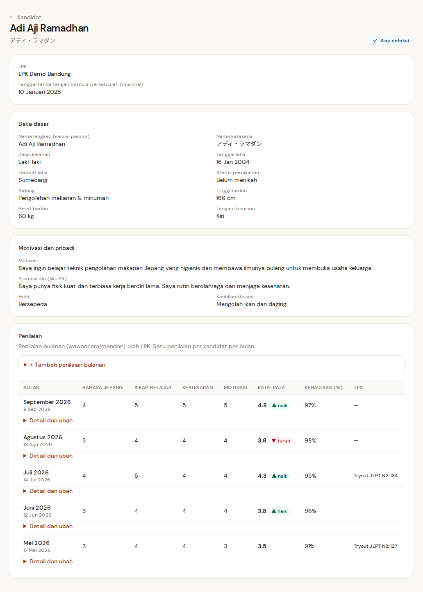

## 3. Panduan TSK (Admin TSK dan Staf TSK)

Menu TSK: **Beranda, Kandidat, Klien, Job order, Catatan kegiatan, Kartu izin tinggal, Pengguna, Riwayat aktivitas**. Perbedaan Admin dan Staf: hanya Admin yang mengelola pengguna, menetapkan penanggung jawab pekerja, dan menghapus klien, lokasi, atau job order.

### 3.1 Kandidat dari LPK mitra

Menu **Kandidat** hanya berisi kandidat LPK mitra yang **dibagikan** ke TSK-mu, di semua status. Kotak filter mirip LPK, ditambah **Keputusan TSK**. Kartu beranda (mis. **Menunggu keputusan**) membuka daftar yang sama.

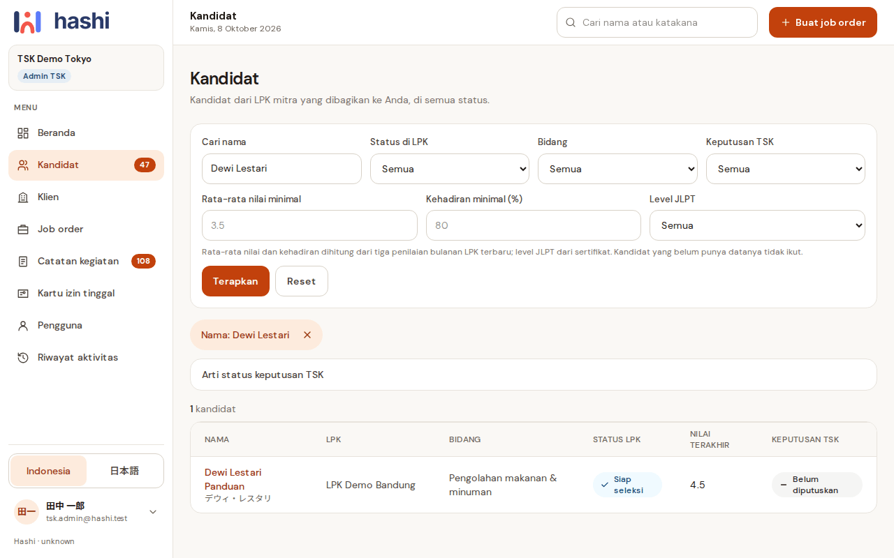

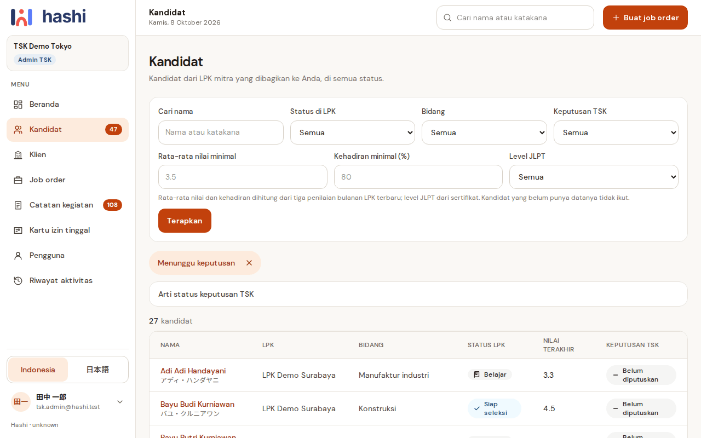

### 3.2 Keputusan dan catatan TSK

Pada halaman detail, bagian **Keputusan TSK** menyimpan keputusan **milik organisasimu** (tidak mengubah status di LPK dan tidak terlihat TSK lain). Urutannya:

**Belum diputuskan → Masuk shortlist → Lulus wawancara TSK → Diajukan ke klien → Lulus interview klien → Proses dokumen → Berangkat**, atau **Ditolak**.

Pilih **Untuk job order**: **Umum (tanpa job order)** untuk tahap awal. Keputusan **Lulus interview klien, Proses dokumen, dan Berangkat wajib memilih job order** yang sebidang dengan kandidat.

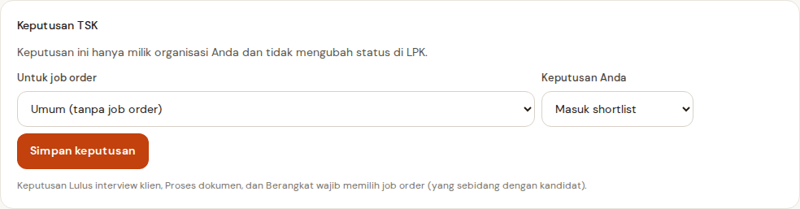

Bagian **Catatan TSK** menyimpan catatan internal. Pilihan **Hanya TSK** (bawaan) atau **Bagikan ke LPK**. Jangan membagikan hal yang tidak boleh diketahui LPK. Catatan tidak bisa dihapus; mengubah hanya bisa oleh penulisnya atau Admin TSK.

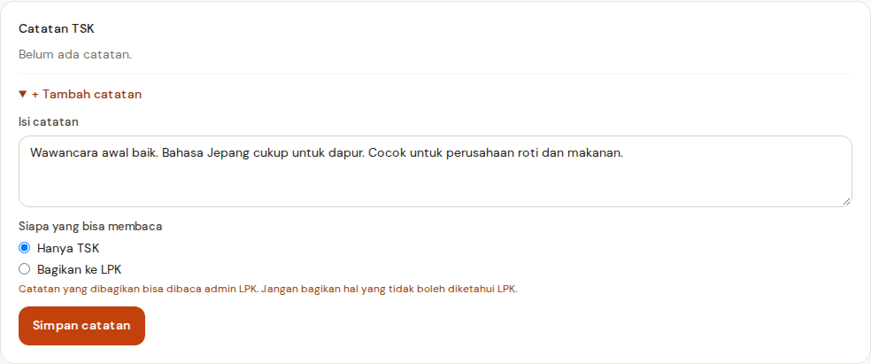

Data kandidat (profil, dokumen) baru bisa **diedit oleh TSK** setelah keputusan **Lulus interview klien** atau sesudahnya; sebelum itu halaman memberi tahu bahwa kandidat hanya dibaca.

### 3.3 Penilaian interview dan kunjungan

Bagian **Penilaian TSK** punya dua form: **+ Tambah kunjungan** (kapan saja) dan **+ Tambah interview TSK** (aktif setelah keputusan **Lulus wawancara TSK** atau sesudahnya; sebelum itu tertulis alasannya). Isinya empat nilai 1 sampai 5, catatan, dan pilihan **Hanya TSK** atau **Bagikan ke LPK**. Penilaian bulanan dari LPK juga tampil di halaman yang sama, **hanya dibaca**.

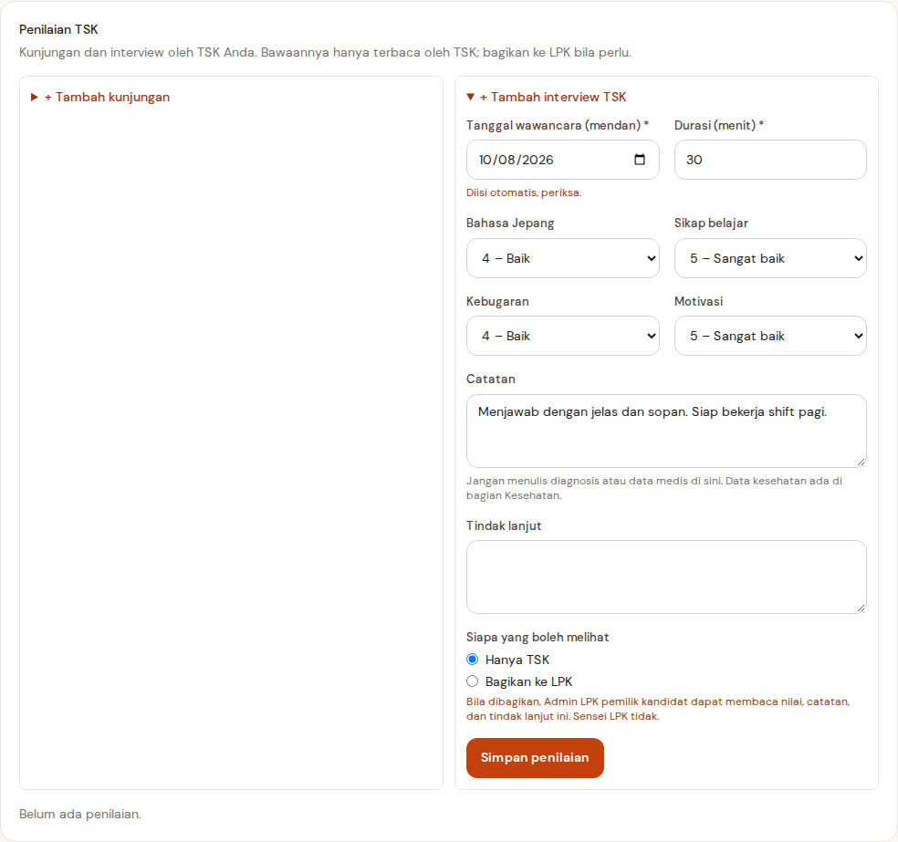

### 3.4 Klien, lokasi, dan PIC

Menu **Klien** adalah daftar perusahaan penerima (法人), lokasi kerjanya (事業所), dan orang kontak (PIC). Data ini **hanya milik TSK-mu**; LPK tidak melihatnya.

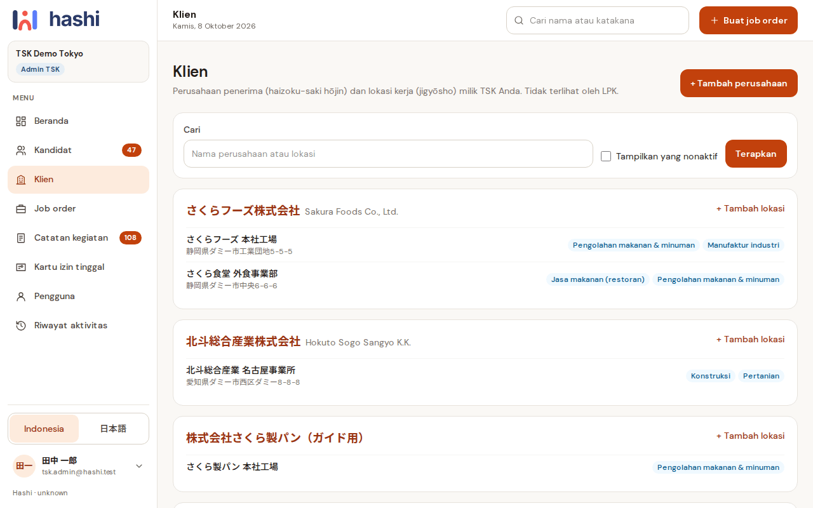

Langkah menambah klien:

1. **+ Tambah perusahaan**, isi **Nama perusahaan**, lalu **Tambah perusahaan**.

   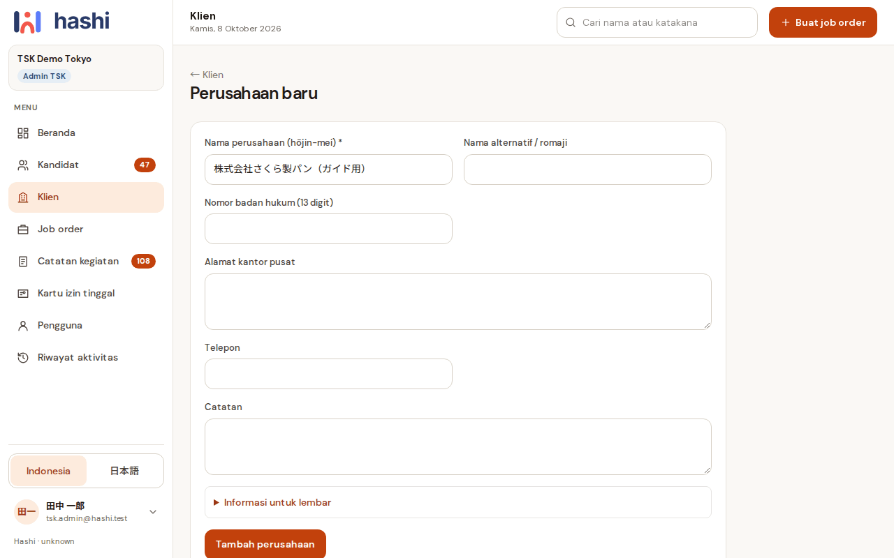

2. Pada halaman perusahaan, tekan **+ Tambah lokasi**, isi nama lokasi, dan **centang bidang kerja yang diterima lokasi** (job order lokasi itu hanya bisa memakai bidang yang dicentang).

   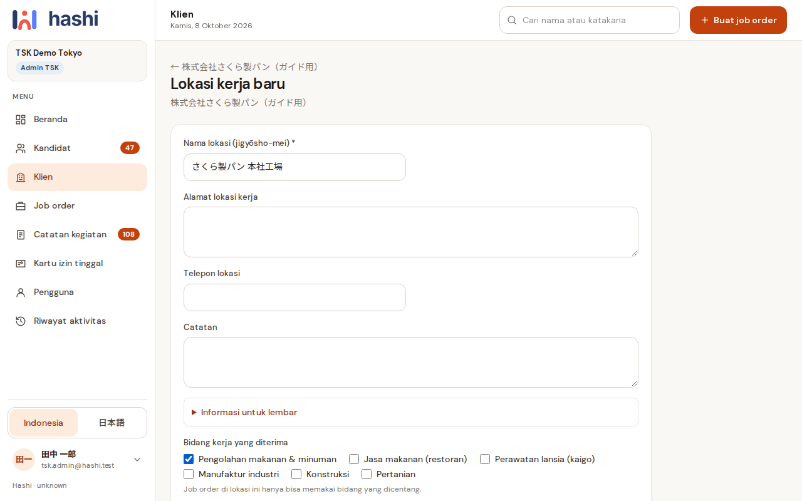

3. Pada halaman lokasi, tambahkan **PIC** (jabatan, nama, telepon).

   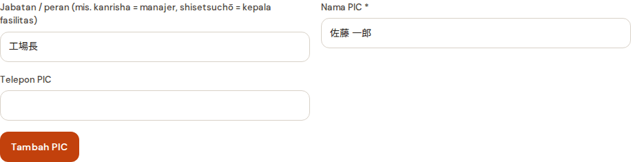

Hapus permanen perusahaan, lokasi, PIC, atau job order hanya untuk Admin TSK, dan ditolak bila masih dirujuk data lain.

### 3.5 Job order

**Job order** adalah permintaan tenaga kerja dari klien. Menu **Job order** menampilkan daftar dengan kolom **Terpilih / posisi** dan **Status**.

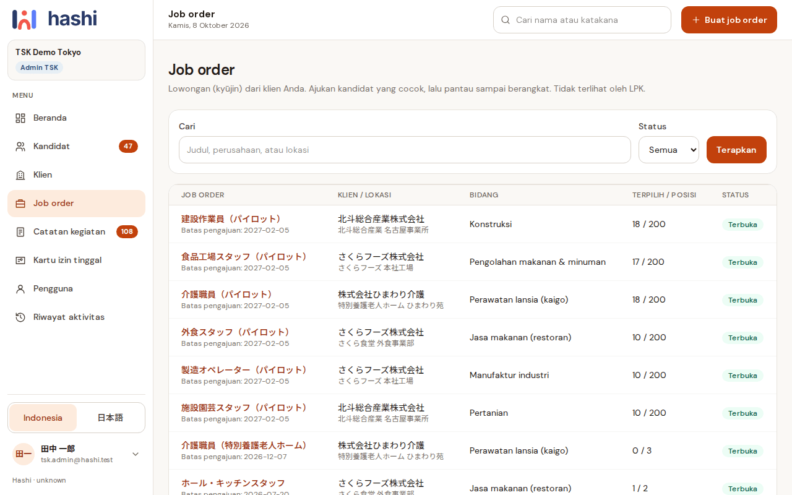

Tekan **Buat job order**, pilih lokasi, lalu isi judul, **Bidang kerja**, **Jenis program**, **Jumlah posisi**, serta (opsional) uraian pekerjaan, gaji, level JLPT minimum, syarat JFT dan jenis kelamin, tanggal mulai, dan batas pengajuan.

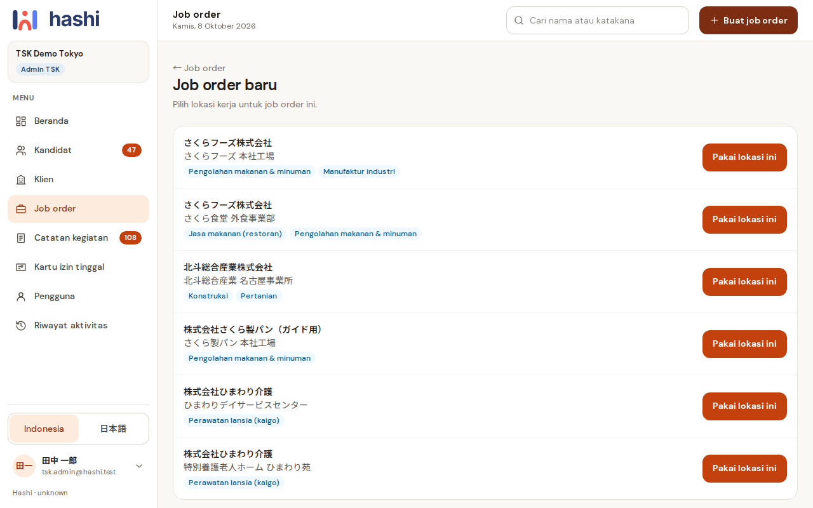

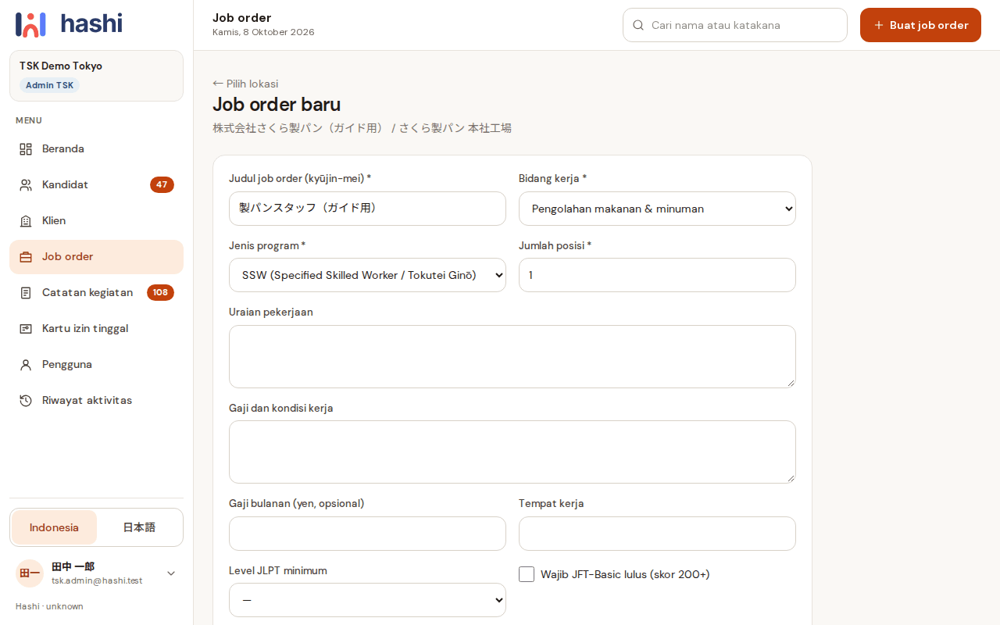

Setelah disimpan, job order berstatus **Terbuka · 0 / 1** (terpilih / posisi). Statusnya berubah **Terisi** otomatis saat jumlah kandidat yang lulus interview klien (atau lebih jauh) mencapai jumlah posisi. Kamu juga bisa **Tutup job order** atau **Tandai terisi** secara manual.

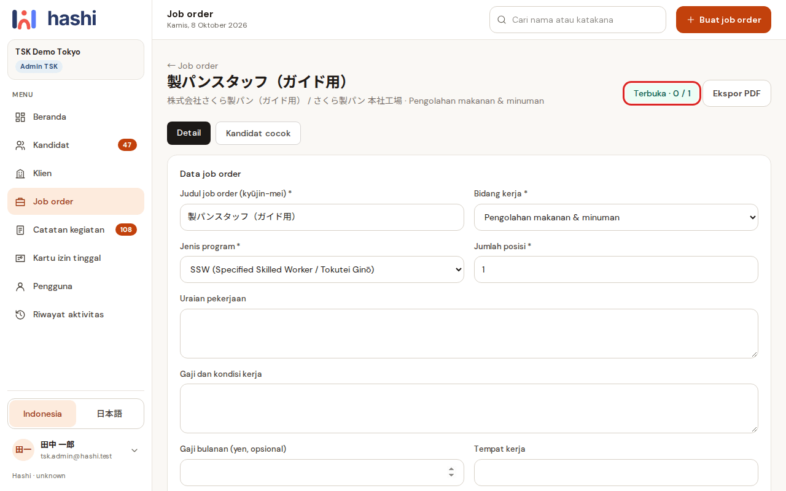

### 3.6 Kandidat cocok dan Ajukan

Buka tab **Kandidat cocok** pada job order. Daftarnya berisi kandidat yang **dibagikan LPK**, **sebidang**, dan belum Mundur, diurutkan dari rata-rata nilai bulanan terbaru. Kolom **Syarat** memberi tanda hijau (memenuhi) atau merah (belum) untuk JLPT, JFT, dan jenis kelamin. Tekan **Ajukan** untuk mengajukan kandidat ke klien pada job order itu.

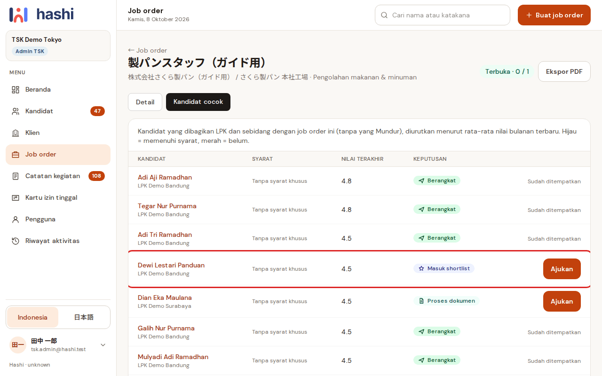

Setelah itu keputusannya menjadi **Diajukan ke klien** dan tombol berganti menjadi **Sudah diajukan**.

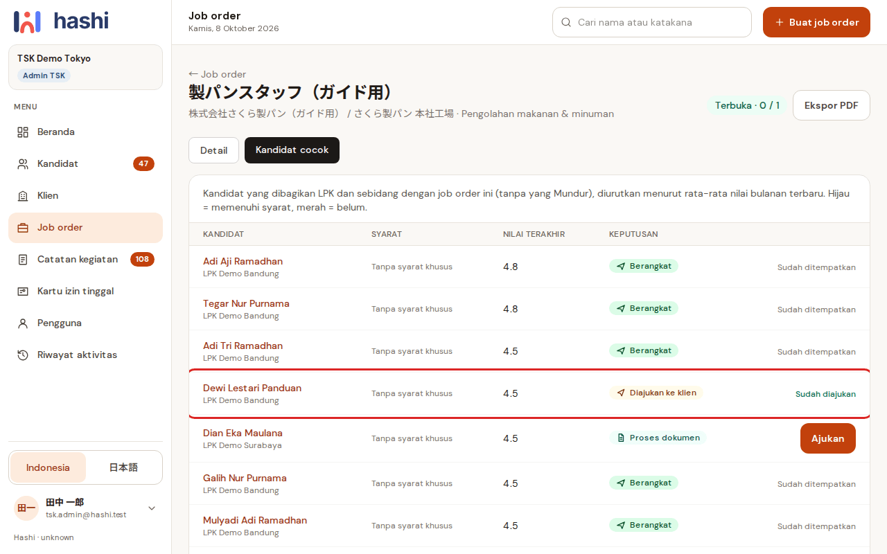

### 3.7 Sampai berangkat dan menjadi pekerja aktif

Di halaman detail kandidat, pilih **Untuk job order** (job order tadi) dan keputusan berikutnya, lalu **Simpan keputusan**:

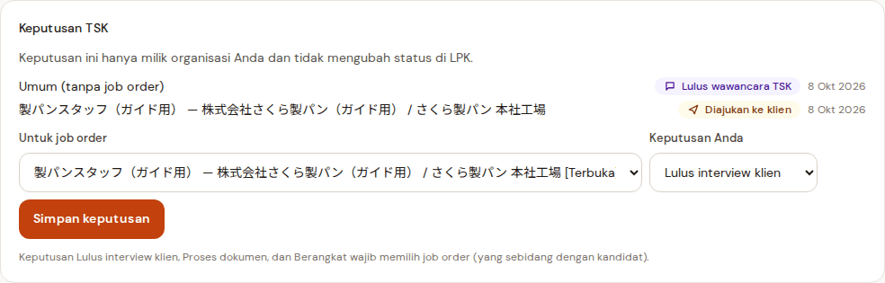

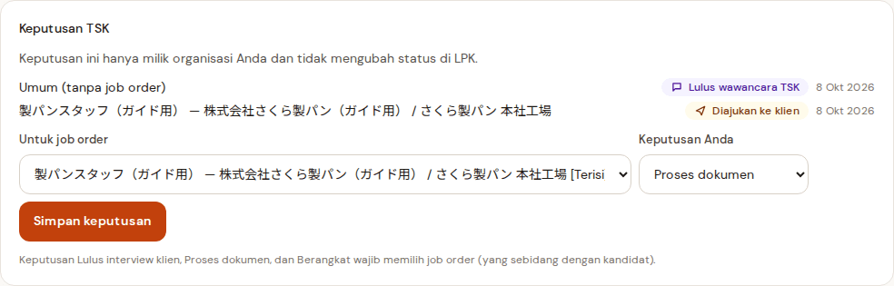

Saat keputusan menjadi **Berangkat**, Hashi otomatis membuat **Penempatan (haizoku)** berstatus **Aktif**, dan kandidat menjadi **pekerja aktif** (muncul di Catatan kegiatan dan Kartu izin tinggal). Isi **Tanggal mulai kerja (shūrō kaishibi)** di bagian ini.

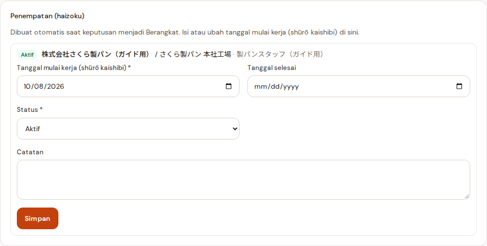

Job order yang terisi berubah status menjadi **Terisi · 1 / 1**.

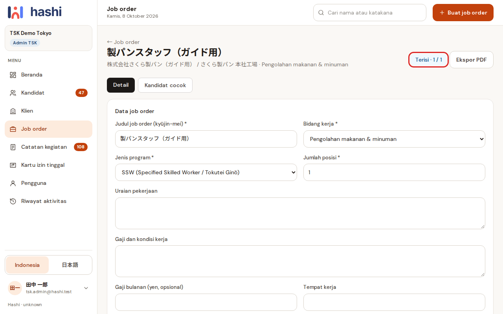

### 3.8 Lembar klien (PDF)

Pada halaman perusahaan dan job order ada tombol **Ekspor PDF**. Dialognya menampilkan **pratinjau** isi PDF dan memberi dua pilihan:

- **Mode**: **Hanya internal (Shanaiyō)** memuat semua isian; jangan dikirim ke luar. **Untuk dibagikan (Teikyōyō)** membuang telepon PIC, catatan internal, syarat jenis kelamin, dan nama staf penyusun; sebelum mengunduh kamu harus mencentang konfirmasi.
- **Bahasa label**: **Jepang** atau **Jepang + Indonesia**.

Bagian yang kosong dilewati, dan dialog memberi tahu isian apa yang belum diisi. Format ini masih **rancangan (DRAFT)** sampai dikonfirmasi TSK.

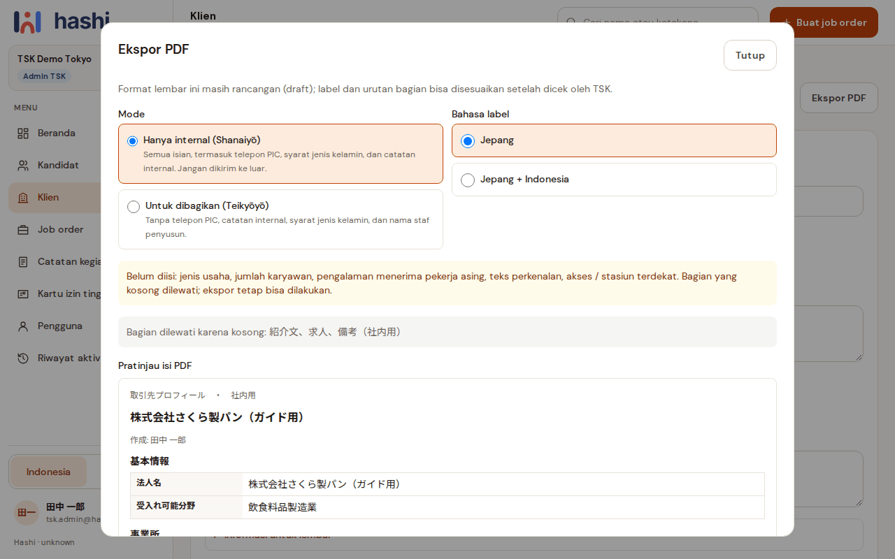

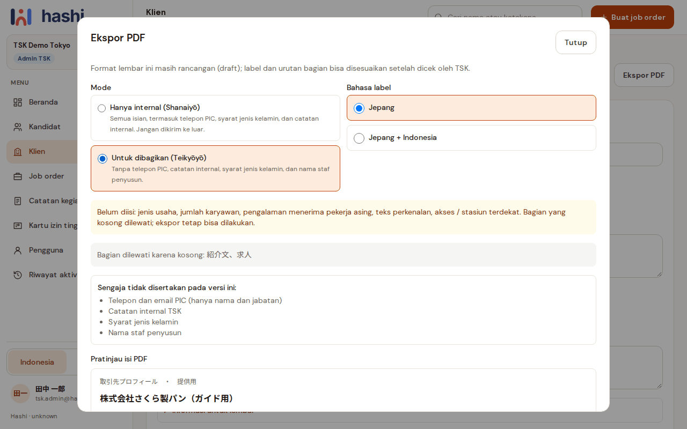

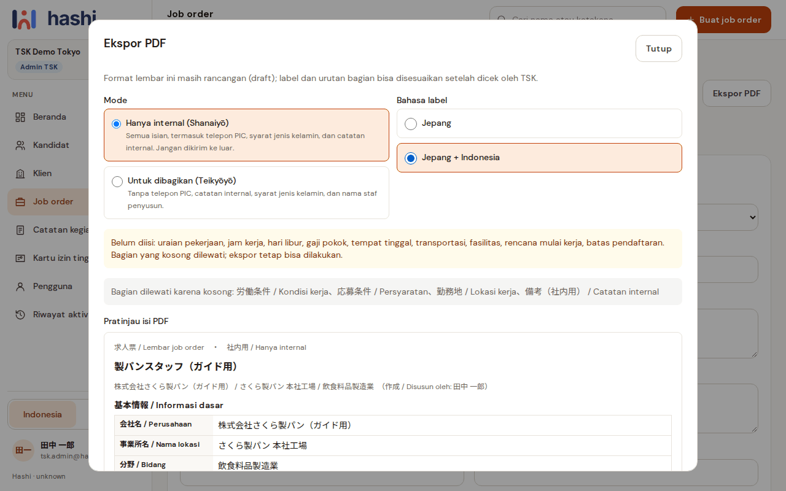

### 3.9 Catatan kegiatan

Menu **Catatan kegiatan** adalah buku kerja staf TSK untuk pekerja yang **sedang bekerja di Jepang**. Isi catatan ditulis dalam bahasa Jepang. Tab di atasnya: **Catatan kerja harian (Gyōmu Kiroku)**, **Notulen dan catatan pertemuan (Gijiroku / Mendan Kiroku)**, **Kasus (Kronologi kasus, Jikeiretsu)**, **Wawancara berkala (Teiki Mendan)**, **Tindak lanjut**, **Penanggung jawab**, dan **Kartu izin tinggal**.

Semua staf TSK membaca semua catatan. **Catatan tidak bisa dihapus**: bila salah, pakai **Batalkan catatan** dengan alasan; setiap perubahan menyimpan riwayat versi. Penanda **Belum dibaca** membantu melihat catatan rekan.

**Catatan kerja harian.** Tekan **+ Catatan kerja baru** (atau **Catatan kerja baru** di halaman pekerja). Pilih pekerja, **Jenis pekerjaan** (mis. Penanganan konsultasi), isi **Tindakan yang dilakukan**, **Hasil dan keadaan**, hal yang belum selesai, dan rencana. Foto bisa ditambahkan (HEIC ditolak; foto dibersihkan dari data lokasi).

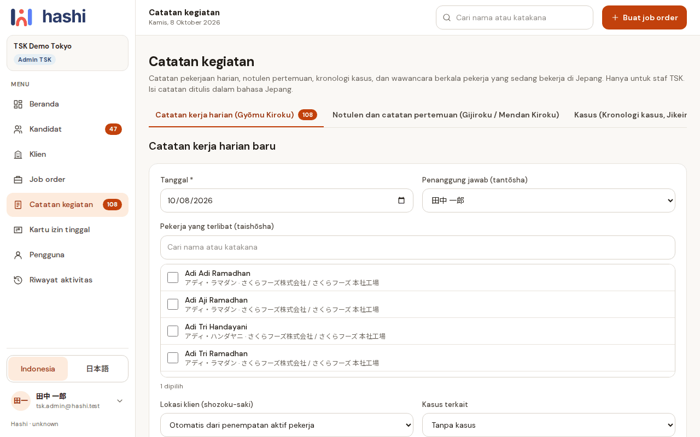

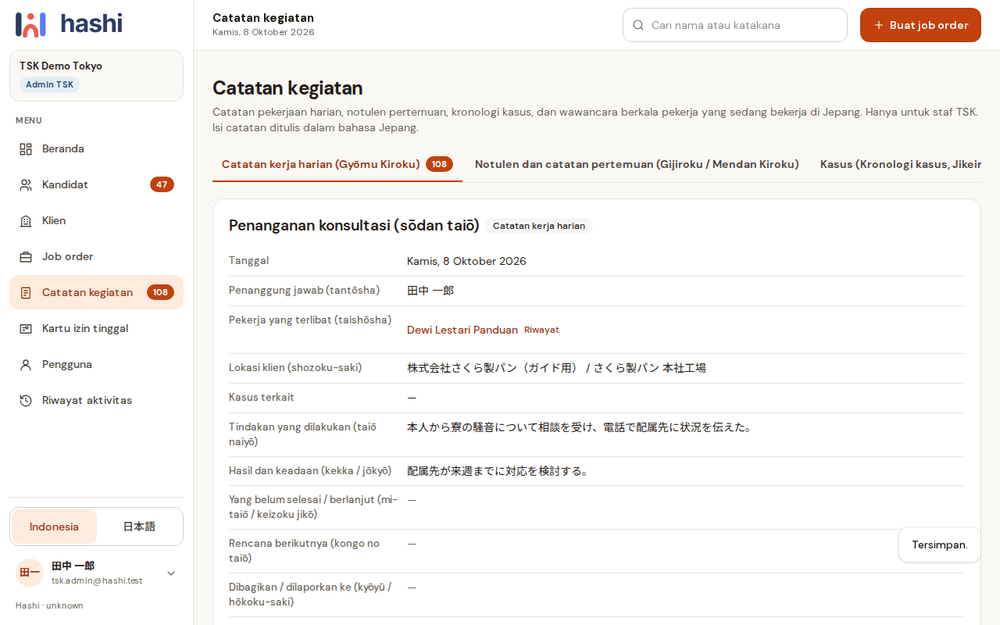

**Tindak lanjut.** Pada sebuah catatan, **+ Tambah tindak lanjut** membuat tugas dengan **Penanggung jawab** dan **Tenggat**. Tab **Tindak lanjut** menampilkan tugas dengan filter **Milikku/Semua** dan status **Terbuka, Lewat tenggat, Selesai, Dibatalkan**.

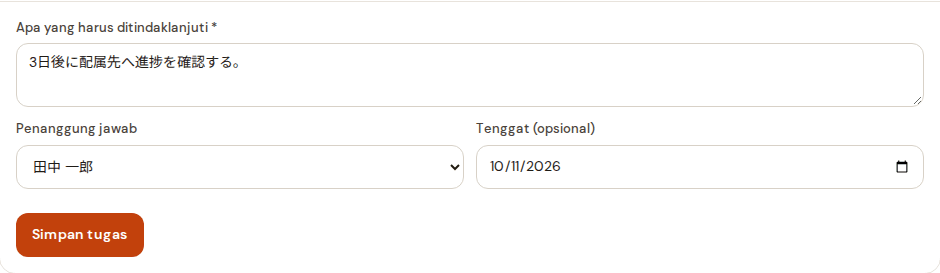

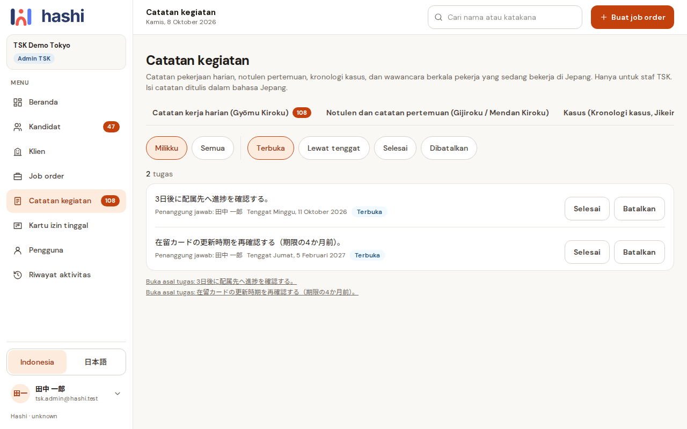

**Kasus dan kronologi.** Satu masalah yang berlangsung lama dicatat sebagai **Kasus** dengan kode `K-tahun-nomor`. Tab **Kasus** → **+ Buat kasus**.

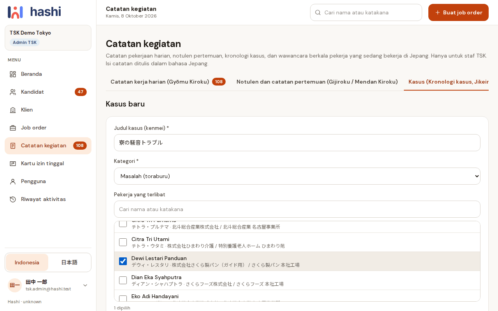

Pada kasus kamu bisa **Tambah notulen**, **Tambah catatan kerja**, **PDF internal**, **PDF untuk klien** (tanpa nama staf dan kode kasus; wajib konfirmasi), dan **Tutup kasus**. **Kronologi kasus** tersusun otomatis dari catatan yang ditautkan.

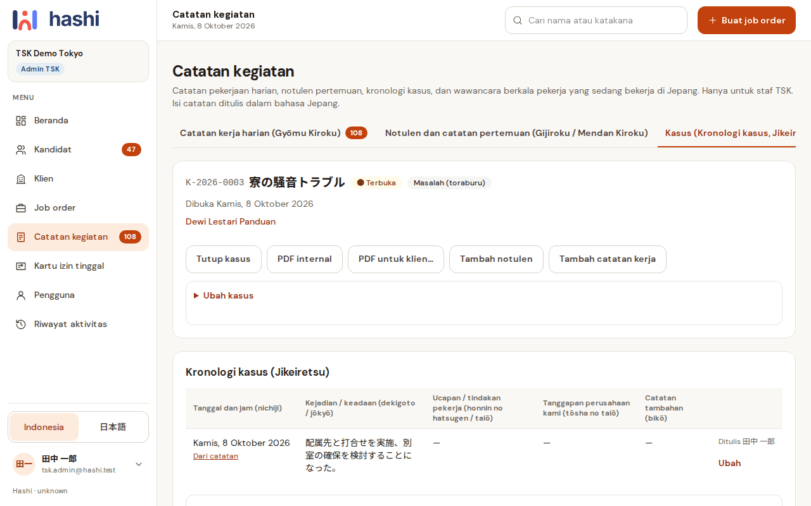

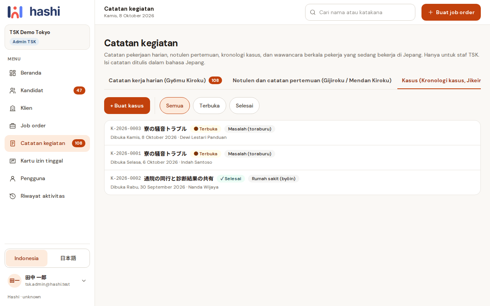

**Notulen dan catatan pertemuan.** Tab **Notulen** → **+ Tambah notulen**: isi **Perihal**, tambahkan poin pembahasan (isi konsultasi, hasil, yang belum ditangani, dan seterusnya), dan baris **Kronologi kejadian** untuk kasus terkait.

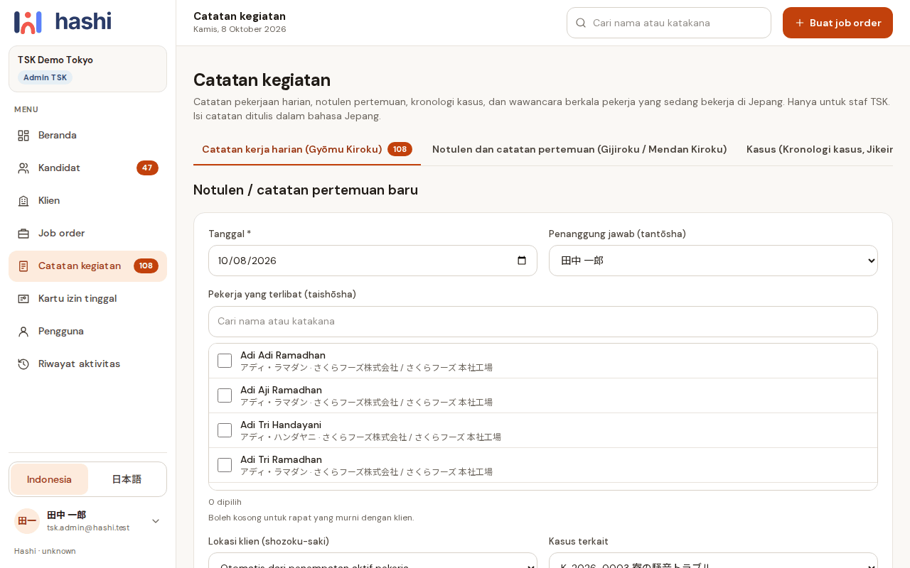

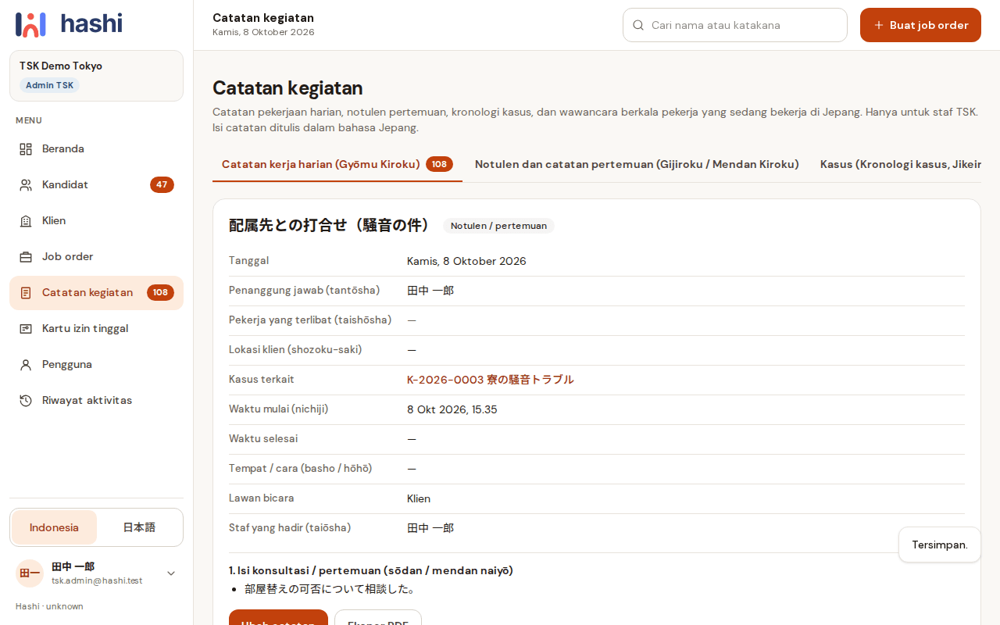

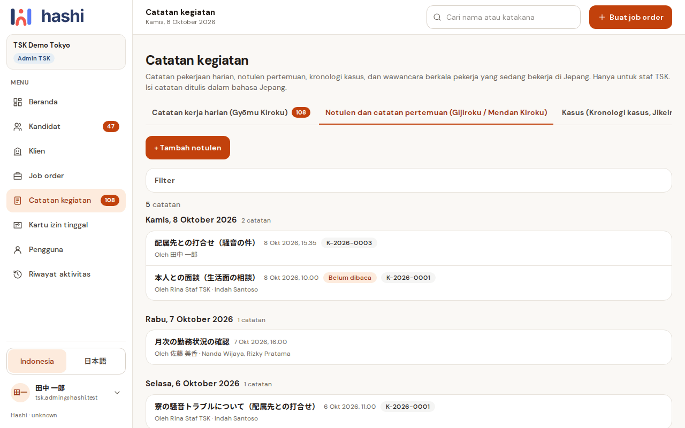

**PDF.** Catatan bisa diekspor lewat tombol **Ekspor PDF** pada halaman catatan.

**Laporan harian.** Kartu **Laporan hari ini** merangkum catatan kerjamu hari ini. Tekan **Kirim ke leader** (Admin TSK). Setelah kamu menambah catatan lagi, tanda "ditambahkan setelah dikirim" muncul. Admin membuka **Laporan harian staf** dan menekan **Tandai sudah dibaca**.

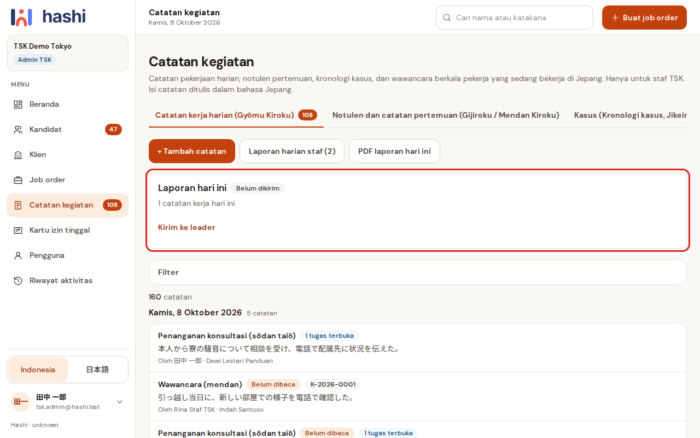

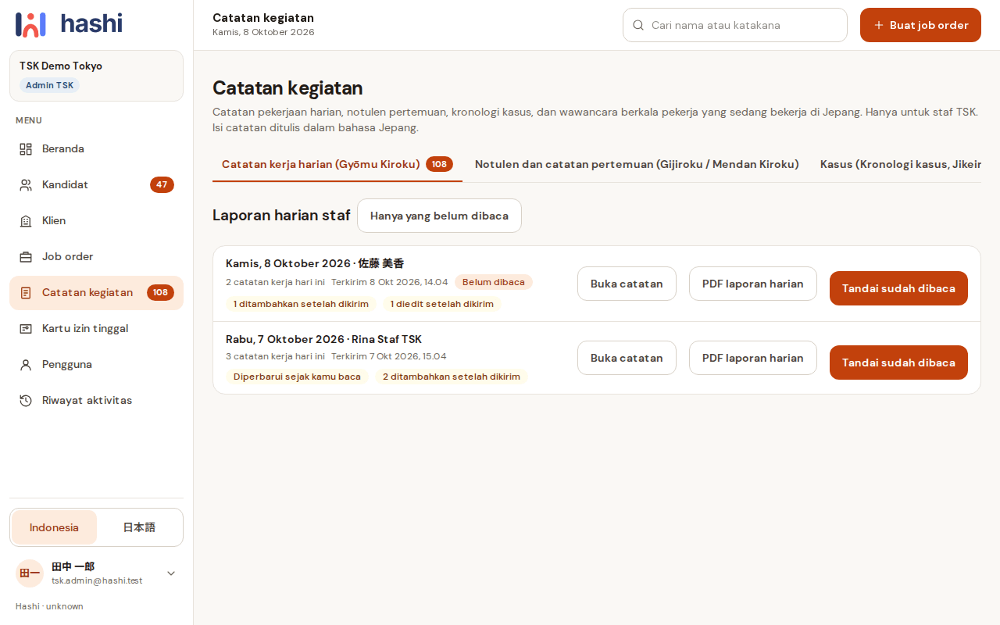

Di ponsel, formulir catatan tersusun satu kolom dan bisa dipakai di lapangan:

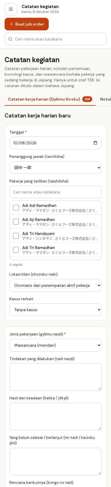

### 3.10 Wawancara berkala dan form 5-5

Tab **Wawancara berkala** menampilkan **grid per tahun fiskal** (April sampai Maret) berisi semua pekerja dan status wawancara tiap bulan/kuartal: **Selesai, Belum (kuartal berjalan), Terlewat (kuartal lewat), Tidak berlaku**. Aturan: wawancara berkala wajib minimal sekali per kuartal. Sebelum kuartal berakhir, bulan masih netral; setelah lewat tanpa wawancara, tanda merah **Terlewat**. Tombol **Daftar laporan tahunan** membuka ringkasan semua pekerja.

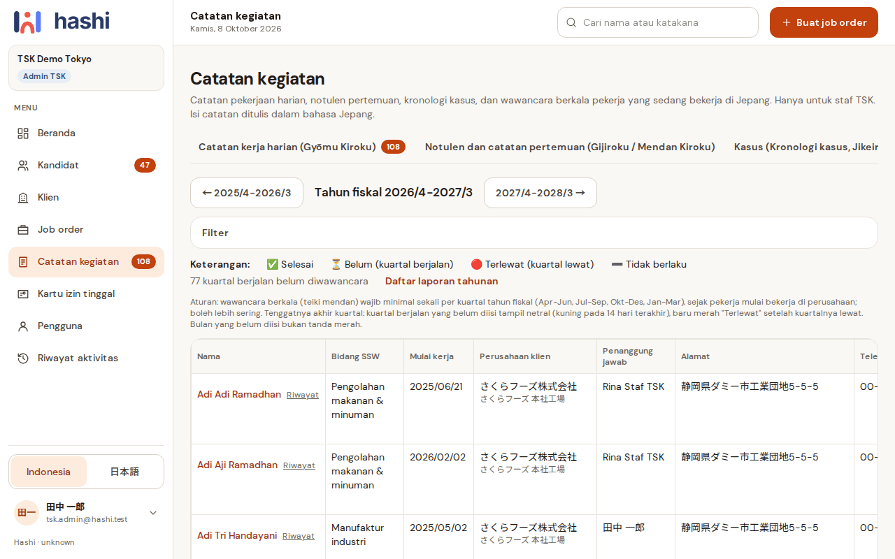

Menekan sebuah bulan membuka **formulir wawancara**: **Berlaku bulan ini?**, **Tanggal wawancara**, **Status** (Tidak ada masalah / Perlu tindak lanjut / Ada masalah / Belum dilaksanakan), alasan pelaksanaan, penanggung jawab, dan isian **form 5-5** (参考様式第5-5号, laporan wawancara berkala ke imigrasi) berupa 18 butir. Teks butir mengikuti form resmi dan masih berstatus **DRAFT** sampai staf TSK memeriksanya.

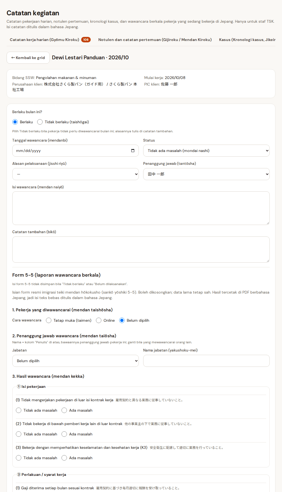

Halaman **Wawancara tahunan** per pekerja menggabungkan seluruh wawancara satu tahun fiskal dan menyediakan PDF-nya.

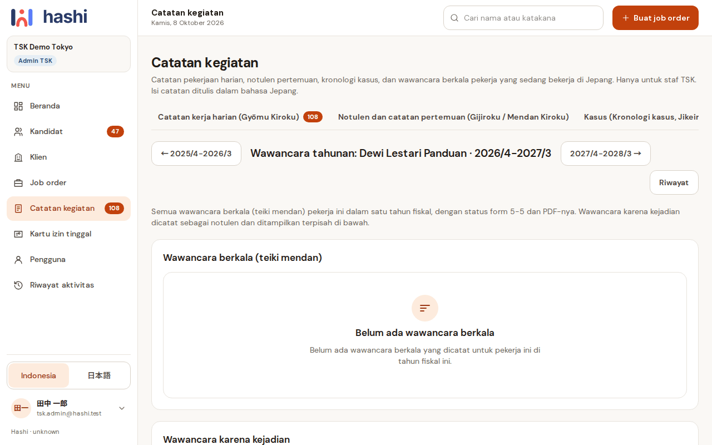

### 3.11 Penanggung jawab (担当) dan beban staf

Tiap pekerja punya satu **penanggung jawab (tantō)**. Dialah yang menerima pengingat kartu dan yang boleh mengubah data kartu pekerjanya (selain Admin TSK). Tab **Penanggung jawab** menampilkan **Beban kerja per staf** dan tombol untuk menetapkan penanggung jawab **per perusahaan** atau **per pekerja** (hanya Admin TSK). Mulai 1 April 2027 satu staf maksimal 50 pekerja; mulai 45 tampil kuning, lebih dari 50 merah. Ini **hanya peringatan**, penyimpanan tidak diblokir.

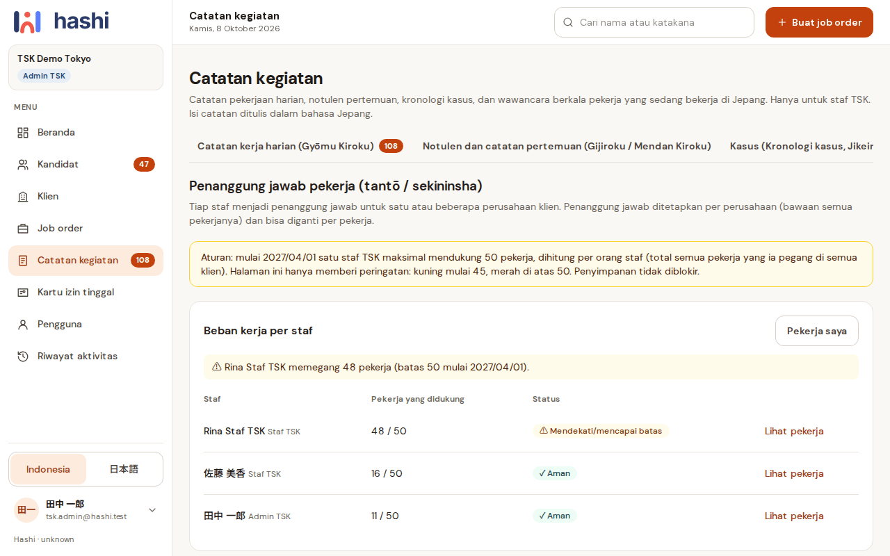

### 3.12 Kartu izin tinggal (在留カード)

**Halaman pekerja.** Buka dari bagian **Catatan kegiatan** pada detail kandidat (tombol **Riwayat lengkap**), dari tab **Penanggung jawab**, atau tombol **Buka** di daftar kartu. Bagian **Kartu izin tinggal (zairyū kādo)** pertama berisi form **Catat kartu pertama**: **Bidang kerja**, **Masa tinggal (zairyū kikan)**, **Tanggal habis (zairyū kigen)**, dan catatan singkat. **Jangan menulis nomor kartu atau data medis di catatan.**

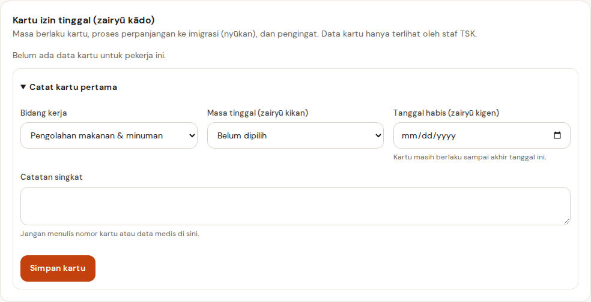

Setelah disimpan, kartu menampilkan **tahap pengingat** dengan penjelasannya:

| Tahap | Artinya |
| --- | --- |
| Belum ada tindakan | Belum waktunya mengurus perpanjangan |
| Mulai siapkan berkas | 4 bulan sebelum habis |
| Sudah bisa mengajukan | 3 bulan sebelum habis |
| Kurang dari 30 / 14 / 7 hari | Belum diajukan; makin mendesak |
| Sudah lewat masa berlaku | Tanggal habis lewat dan belum diajukan |
| Menunggu hasil (kekka machi) | Sudah diajukan; pengingat tidak naik lagi |
| Lewat masa tinggal tambahan | Masa tambahan 2 bulan lewat, hasil belum keluar |
| Permohonan ditolak (fukyoka) | Tentukan langkah berikutnya |

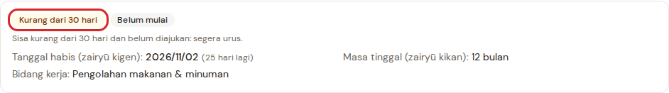

**Nomor dan foto kartu.** Bagian ini menyimpan nomor dan foto sisi depan/belakang **terenkripsi**. Hanya **penanggung jawab pekerja** dan **Admin TSK** yang bisa melihat atau mengubahnya; staf lain tidak melihat apa pun. Nomor tampil tersamar sampai kamu menekan **Tampilkan**; setiap tampilan nomor dan setiap pembukaan foto dicatat di riwayat aktivitas. Nomor tidak pernah ada di daftar, ekspor, atau email.

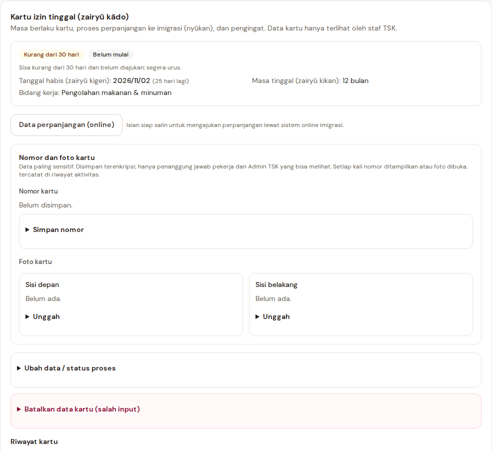

**Data perpanjangan online.** Tombol **Data perpanjangan (online)** membuka halaman berisi butir 1 sampai 14 formulir perpanjangan imigrasi (nama romaji, tanggal lahir dalam tahun Jepang, alamat, dan seterusnya) dengan tombol **Salin** di tiap butir, supaya tinggal ditempel ke sistem online imigrasi. Butir yang belum terisi diberi tautan untuk melengkapinya (profil, paspor, kartu, atau **Data pekerja di Jepang**). Halaman ini hanya untuk penanggung jawab dan Admin TSK.

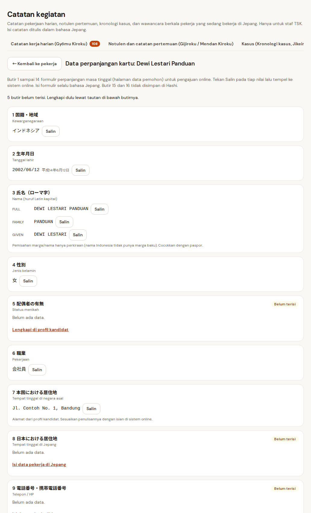

**PDF 手数料納付書 (khusus loket).** Sejak 1 Oktober 2026 pengajuan **online** dibayar lewat konbini/bank, jadi surat ini **hanya untuk pengajuan di loket**. Di bawah halaman data perpanjangan, tombol **手数料納付書 (loket)** mengunduh formulir resmi dengan nama romaji pekerja yang sudah terisi.

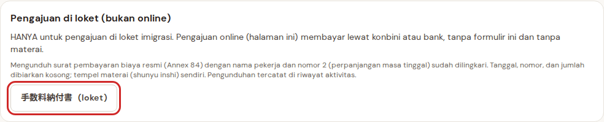

**Status proses.** Buka **Ubah data / status proses** untuk mencatat kemajuan lewat **Status proses perpanjangan**: **Belum mulai**, **Persiapan berkas**, **Sudah diajukan (shinsei-chū)** (isi **Tanggal pengajuan ke imigrasi**), **Diajukan, diminta dokumen tambahan** (tsuika shiryō), atau **Ditolak** (isi tanggal ditolak).

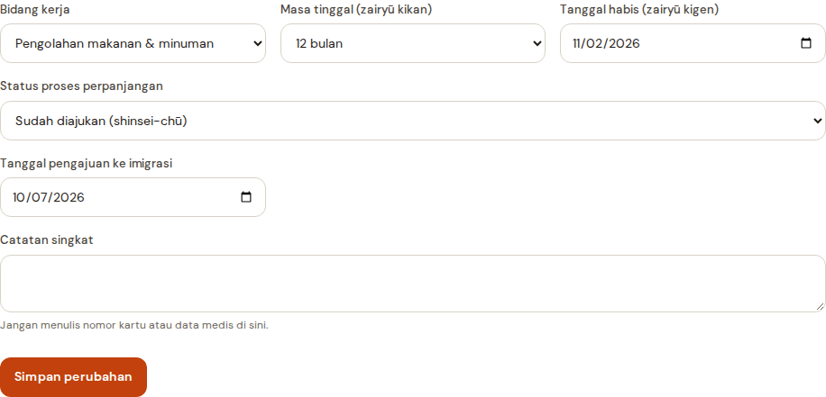

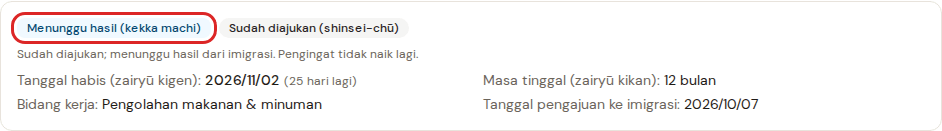

**Terima kartu baru.** Saat kartu baru diterima, isi **Tanggal kartu baru diterima**, **Diambil oleh** (mis. staf, yang lalu menyerahkannya ke pekerja), **Tanggal diserahkan ke pekerja** (boleh dikosongkan dulu), dan data kartu baru (**tanggal habis, masa tinggal, bidang**). Kartu lama otomatis ditandai selesai dan kartu baru menjadi kartu aktif dalam satu langkah; pengingat berhenti.

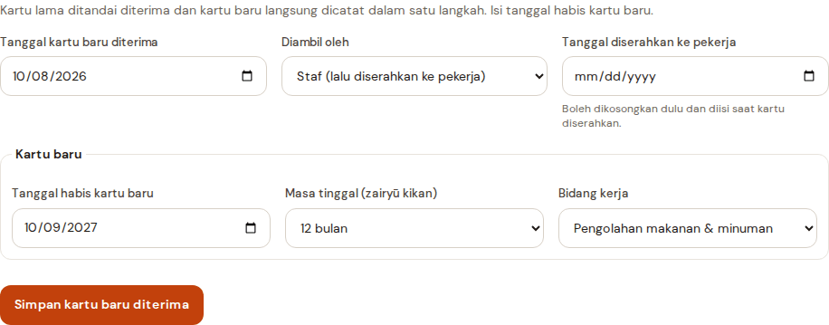

**Riwayat kartu** menyimpan semua kartu dan menunjukkan apakah kartu sudah diserahkan ke pekerja.

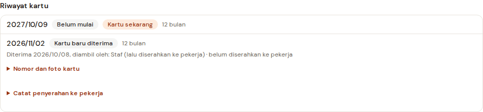

Kalau data kartu salah input, **Batalkan data kartu (salah input)** (dengan alasan); nomor dan foto kartu itu ikut dihapus. Kartu yang sudah diterima tidak bisa dibatalkan.

**Tanggal tiba di Jepang.** Di halaman pekerja, bagian **Tanggal tiba di Jepang** menyimpan tanggal pekerja tiba (tidak boleh di masa depan). Admin LPK pemilik kandidat melihatnya bersama status visa.

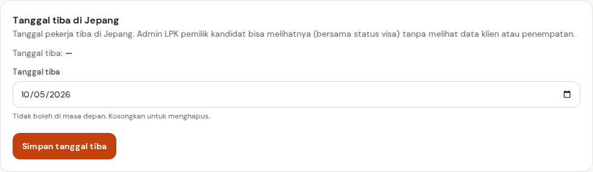

**Daftar kartu.** Menu **Kartu izin tinggal** menampilkan semua pekerja aktif dengan kartunya, yang paling mendesak di atas. Chip: **Semua, Perlu tindakan, Mulai disiapkan, Menunggu hasil, Belum ada data**. Filter: **Hanya pekerja saya**, **Perusahaan**, **Tahap**. Angka di chip sama dengan kartu di beranda.

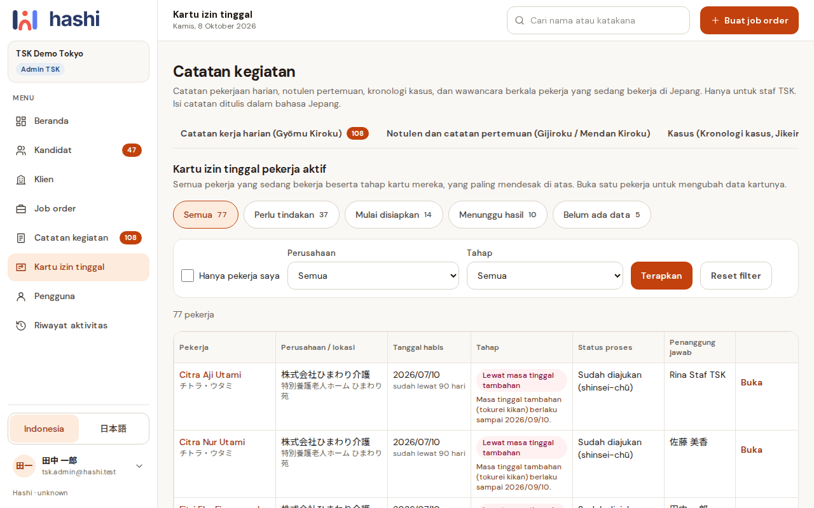

Tampilan Staf TSK sama; kotak **Hanya pekerja saya** menyaring pekerja yang menjadi tanggung jawabnya.

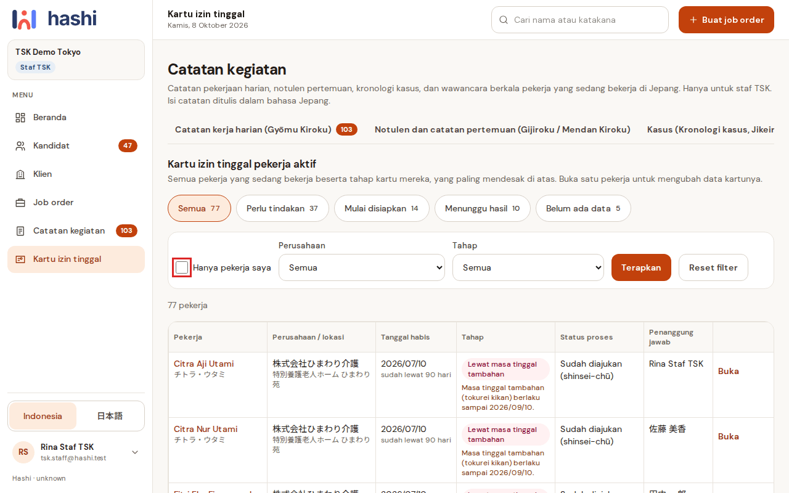

**Email pengingat.** Setiap hari pukul 08:00 waktu Jepang, Hashi mengirim **satu email ringkasan per penerima** bila ada kartu yang masuk tahap: mulai siapkan, bisa mengajukan, H-30, H-14, H-7, lewat masa berlaku, lewat masa tambahan, ditolak, atau perlu dokumen tambahan. Penerimanya **penanggung jawab pekerja** dan **semua Admin TSK aktif**. Alamat contoh seperti `@hashi.test` sengaja **dilewati** (pengaman), jadi pada aplikasi demo email tidak benar-benar terkirim ke akun demo; contoh email di bawah diambil dari lingkungan uji lokal. Email memuat nama pekerja, tahap, sisa hari, dan tautan **Buka di Hashi**; **tidak memuat nomor kartu atau catatan**. Setiap kartu, tahap, dan penerima hanya dikirimi **sekali**. Pengingat berhenti setelah tanggal terima kartu baru diisi. Bahasa email mengikuti bahasa tampilan penerima.

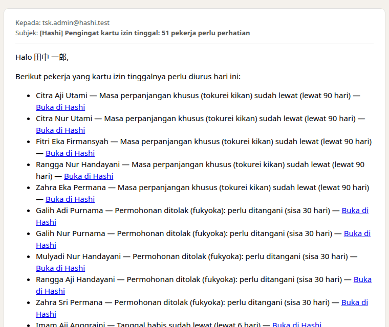

### 3.13 Riwayat aktivitas TSK

Admin TSK melihat **Riwayat aktivitas** organisasinya: keputusan, catatan, ekspor PDF, dan akses kartu (misalnya "Tampilkan nomor"). Riwayat tidak bisa diubah, tidak memuat isi catatan atau nomor kartu, dan bisa diekspor ke CSV.

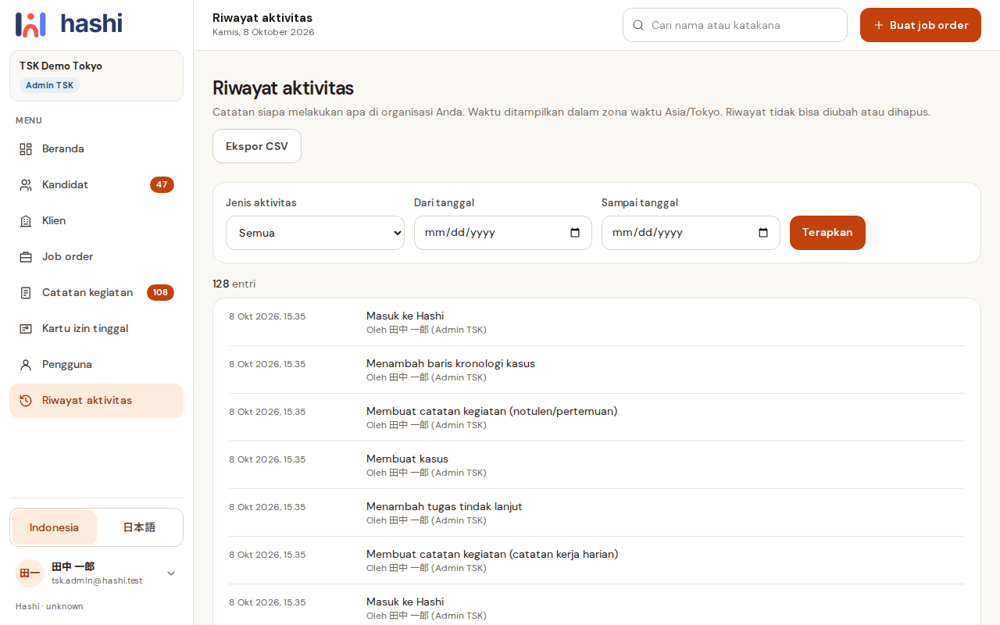

## 4. Contoh kasus

Empat skenario di bawah memakai data dari satu siswa fiktif, **Dewi Lestari Panduan**, dari awal sampai berangkat dan bekerja di Jepang. Ikuti berurutan A, B, C, D untuk hasil yang sama dengan gambar. Gambar-gambarnya sama dengan yang ada di bab 2 dan 3; di sini hanya dirangkai menjadi cerita.

### 4.1 Kasus A: siswa baru sampai siap dilihat TSK

**Akun:** `lpk1.admin@hashi.test`

1. Masuk, buka **Kandidat**. Lihat daftar siswa yang sudah ada.

   

2. Tekan **Tambah kandidat**. Isi nama **Dewi Lestari Panduan**, jenis kelamin **Perempuan**, tanggal lahir **2002-06-12**, bidang **Pengolahan makanan & minuman**, nama katakana, tempat lahir, motivasi, dan alamat. Perhatikan bar **Kelengkapan profil** di bawah.

   

3. Tekan **Simpan kandidat**. Profil dibuat dengan status **Belajar**.

   

4. Unggah **paspor** pada bagian **Dokumen** (pakai file PDF apa saja untuk percobaan).

   

5. Pada bagian **Penilaian**, isi penilaian bulan ini: nilai 4, 5, 4, 5, kehadiran 96, dan catatan singkat. Simpan.

   

6. Ubah **Status di LPK** menjadi **Siap seleksi** dan **Simpan**.
7. Di bagian **Berbagi ke TSK mitra**, centang persetujuan siswa, lalu **Bagikan ke TSK mitra**.

   

8. Pindah akun: masuk sebagai `tsk.admin@hashi.test`, buka **Kandidat**, cari "Dewi". Kandidat kini terlihat oleh TSK.

   

### 4.2 Kasus B: dari shortlist sampai berangkat

**Akun:** `tsk.admin@hashi.test` (lalu `lpk1.admin@hashi.test` untuk langkah terakhir)

1. Buka profil Dewi. Pada **Keputusan TSK**, pilih **Masuk shortlist** (job order **Umum**) lalu **Simpan keputusan**. Tulis **Catatan TSK** dan simpan.

   

2. Buat klien: menu **Klien** → **+ Tambah perusahaan** → nama perusahaan.

   

3. Tambah **lokasi** dan centang bidang **Pengolahan makanan & minuman**; tambah **PIC**.

   

4. Menu **Job order** → **Buat job order**, pilih lokasi, isi judul, bidang **Pengolahan makanan & minuman**, posisi **1**.

   

5. Buka tab **Kandidat cocok**. Dewi muncul di daftar, dengan status **Masuk shortlist**.

   

6. Kembali ke profil Dewi: set keputusan **Lulus wawancara TSK** (job order **Umum**). Form **+ Tambah interview TSK** kini aktif; isi penilaian interview dan simpan.

   

7. Pada **Kandidat cocok**, tekan **Ajukan** di baris Dewi. Keputusan menjadi **Diajukan ke klien**.

   

8. Di profil Dewi, pilih **Untuk job order** = job order tadi dan keputusan **Lulus interview klien**; lalu **Proses dokumen**; lalu **Berangkat**.

   

   

9. Job order menjadi **Terisi · 1 / 1**. Untuk bahan tawaran ke klien lain, ekspor **Lembar klien** (mode internal untuk dokumen sendiri, mode dibagikan untuk dikirim).

   

   

10. Isi **Tanggal tiba di Jepang** pada halaman pekerja (detail kandidat → **Catatan kegiatan** → **Riwayat lengkap**).

    

11. Masuk sebagai `lpk1.admin@hashi.test`, buka profil Dewi. **Keputusan TSK** menunjukkan **Berangkat**, dan **Setelah berangkat** menampilkan tanggal tiba.

    

### 4.3 Kasus C: kartu izin tinggal hampir habis

**Akun:** `tsk.admin@hashi.test`

Dewi sudah bekerja. Kartu izin tinggalnya habis dalam 25 hari.

1. Buka halaman pekerja Dewi (detail kandidat → bagian **Catatan kegiatan** → **Riwayat lengkap**). Bagian kartu masih kosong.

   

2. Isi **Catat kartu pertama**: masa tinggal **12 bulan**, **tanggal habis** 25 hari dari hari ini. Simpan.

   

3. Tahap menjadi **Kurang dari 30 hari** ("segera urus"). Pada pengiriman pagi berikutnya (pukul 08:00 waktu Jepang), Hashi mengirim email pengingat ke penanggung jawab dan Admin TSK (di aplikasi demo email tidak terkirim ke akun `@hashi.test`; contoh isinya ada di gambar).

   

   

4. Tekan **Data perpanjangan (online)**. Salin butir 1 sampai 14 ke sistem online imigrasi. Untuk pengajuan di loket, unduh juga **手数料納付書**.

   

5. Setelah mengajukan, buka **Ubah data / status proses**, pilih **Sudah diajukan (shinsei-chū)**, isi tanggal pengajuan, dan simpan.

   

6. Tahap menjadi **Menunggu hasil (kekka machi)**; pengingat tidak naik lagi.

   

7. Kartu baru datang: buka **Terima kartu baru**, isi tanggal diterima, diambil oleh siapa, dan tanggal habis kartu baru. Simpan.

   

8. Riwayat kartu kini berisi dua kartu; pengingat berhenti. Admin LPK melihat status visa **Berlaku** dengan tanggal berlaku yang baru.

   

   

### 4.4 Kasus D: masalah di tempat kerja

**Akun:** `tsk.admin@hashi.test`

Dewi mengeluh tentang kebisingan di asrama.

1. Buka **Catatan kegiatan** → **+ Catatan kerja baru** (atau lewat halaman pekerja, supaya pekerjanya sudah terpilih). Pilih **Jenis pekerjaan** = **Penanganan konsultasi**, isi tindakan dan hasilnya (dalam bahasa Jepang). Simpan.

   

2. Pada catatan itu, tambahkan **tindak lanjut**: "konfirmasi ke klien dalam 3 hari", penanggung jawab, tenggat.

   

3. Masalah berlangsung lama, jadi buat **Kasus** (**Catatan kegiatan** → **Kasus** → **+ Buat kasus**), kaitkan dengan Dewi.

   

4. Setelah bertemu klien, tambahkan **Notulen** pada kasus itu: perihal, poin pembahasan, dan satu baris **Kronologi kejadian**.

   

5. Buka kasus untuk melihat **kronologi** yang tersusun otomatis. Bila klien perlu menerima ringkasan, pakai **PDF untuk klien** (tanpa nama staf dan kode kasus; wajib konfirmasi).

   

6. Di akhir hari, buka kartu **Laporan hari ini** dan tekan **Kirim ke leader**.

   

7. Pada tab **Wawancara berkala**, wawancara kuartal ini untuk Dewi bisa dicatat sekaligus bila memang waktunya.

   

## 5. Tanya jawab dan istilah

**Kenapa kandidat tidak terlihat oleh TSK?** Hanya kandidat yang **dibagikan** LPK-nya yang terlihat. Bisa jadi belum dibagikan, atau berbagi sudah dihentikan, atau LPK-nya bukan mitra TSK-mu. Minta Admin LPK mengecek bagian **Berbagi ke TSK mitra**.

**Kenapa tombol atau form tidak bisa dipakai?**

- Form **interview TSK** nonaktif sampai keputusan TSK mencapai **Lulus wawancara TSK** atau sesudahnya (alasannya tertulis di form).
- Tombol **Ajukan** hilang bila job order tidak lagi **Terbuka**, kandidat **Mundur**, atau sudah ditempatkan.
- Keputusan **Lulus interview klien, Proses dokumen, Berangkat** meminta job order.
- Profil kandidat hanya dibaca oleh TSK sampai keputusan **Lulus interview klien** atau sesudahnya.
- Nomor dan foto kartu serta tombol ubah kartu hanya untuk **penanggung jawab pekerja** dan **Admin TSK**; staf lain hanya membaca ringkasan.
- Tombol **Hapus permanen** tidak aktif sampai nama kandidat diketik persis, dan penghapusan ditolak bagi kandidat yang sedang diproses TSK.

**Kenapa halaman mengatakan "tidak ditemukan" (404)?** Halaman tidak ada **atau** kamu tidak berhak melihatnya; pesannya sengaja sama supaya keberadaan data tidak bocor. Contoh: Admin LPK membuka alamat halaman klien.

**Bisakah saya menerjemahkan halaman dengan Chrome ("Terjemahkan")?** Bisa. Label dan tulisan bebas (catatan, notulen, motivasi) ikut diterjemahkan; yang dikunci hanya identitas (nama, alamat, telepon, kode, nomor dokumen). Pengecualian: **catatan kesehatan** dikunci karena Chrome mengirim teks terjemahan ke server Google.

**Apakah ada mode gelap?** Belum. Hashi selalu tampil terang.

**Apa saja yang dicatat di riwayat aktivitas?** Siapa, kapan, dan jenis tindakan (masuk, ubah data, unduh dokumen, keputusan TSK, ekspor, melihat nomor kartu, dan sebagainya), beserta **nama kolom** yang berubah. **Tidak** dicatat: isi catatan, nama kandidat, nomor dokumen, nomor kartu. Riwayat tidak bisa diubah atau dihapus, termasuk oleh admin.

**Bisakah catatan atau kandidat dihapus?** Catatan kegiatan **tidak bisa dihapus** (hanya dibatalkan dengan alasan); kandidat hanya bisa dihapus permanen oleh Admin LPK dengan syarat di bagian 2.11.

**Data apa yang aman dicoba di demo?** Semuanya dummy. Jangan memasukkan data siswa atau pekerja sungguhan ke aplikasi demo.

**Istilah.** Kamus lengkap istilah Jepang, cara baca, dan padanan Indonesia ada di [glossary.md](../glossary.md). Beberapa yang sering muncul:

| Istilah | Arti |
| --- | --- |
| LPK | Lembaga pelatihan kerja di Indonesia |
| TSK (登録支援機関) | Lembaga pendukung terdaftar di Jepang |
| 配属先 (haizoku-saki), Klien | Perusahaan tempat pekerja ditempatkan |
| 求人 (kyūjin), Job order | Permintaan tenaga kerja dari klien |
| 担当 (tantō) | Penanggung jawab pekerja |
| 在留カード (zairyū kādo) | Kartu izin tinggal |
| 在留期限 (zairyū kigen) | Tanggal habis izin tinggal |
| 入管 (nyūkan) | Imigrasi |
| 面談 (mendan) | Wawancara |
| 定期面談 (teiki mendan) | Wawancara berkala pekerja |
| 業務記録 (gyōmu kiroku) | Catatan kerja harian |
| 時系列 (jikeiretsu) | Kronologi kasus |
